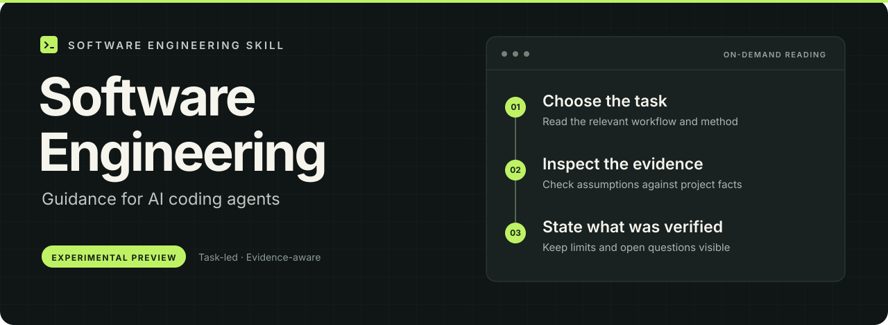

  

  <strong>让工程判断有依据，让验证范围说清楚。</strong> 
  面向 AI 编程代理的实验性中文软件工程 Skill。

  <a href="#项目状态">项目状态</a> ·
  <a href="#工作流程示意">观看示意短片</a> ·
  <a href="#内容范围">内容范围</a> ·
  <a href="README.md">English</a>

> **项目预览。** 当前仓库只提供项目介绍与原创演示素材，可安装的 Skill 运行包尚未在此发布。

## 项目思路

从当前工程问题出发，检查相关需求、代码或观察结果，选择适用的方法，说明主要取舍，以及实际验证了什么。

正在准备的 Skill 按任务组织内容，让代理读取相关流程和方法，而非每次加载整个参考集合。目标是给出具体判断、对应证据与尚未解决的限制。

- **说清前提**：区分已确认事实、约束与未知
- **按任务选方法**：让处理深度与当前问题相称
- **让结论可复查**：保留依据、验证范围与剩余风险

## 工作流程示意

这段原创短片为 27 秒，用来说明预期交互方式。它不是实际安装运行、性能测试或真实项目结果的录像。

https://github.com/user-attachments/assets/f8a918e0-594f-4232-ab0f-bd87f8b0b2c7

## 内容范围

正在准备的运行包包含十条任务流程，涉及：

- 需求澄清与验收
- 架构、领域与集成设计
- 功能实现
- 代码与变更审查
- 测试策略与验证
- 缺陷诊断
- 重构与遗留改动
- 集成、构建与交付
- 运行可靠性与运维
- 工程计划与协作

这些是指导内容的范围，不表示每项工程能力均已验证。Skill 不会增加代理修改、发布或操作系统的权限。

## 项目状态

运行包仍在等待适用的发布检查完成。当前仓库没有 `SKILL.md`，也不提供安装命令。

目前已完成独立分发边界整理、来源标注审查，以及候选的文件、链接和路由静态检查。最终运行行为与宿主发现检查尚未完成，真实工程效果也未评估。

本项目不宣称已证明质量提高、速度加快或成本降低。当前边界见 [STATUS.md](STATUS.md)。

## 许可与反馈

本仓库的原创介绍文字和演示素材采用 [MIT 许可证](LICENSE)。该授权不改变第三方作品的权利，详见 [NOTICE.md](NOTICE.md)。

欢迎在 Issues 提出问题或针对项目方向给出具体反馈。请使用原创虚构例子，不要提交私有源码、生产日志、个人信息或受版权限制的原文。
