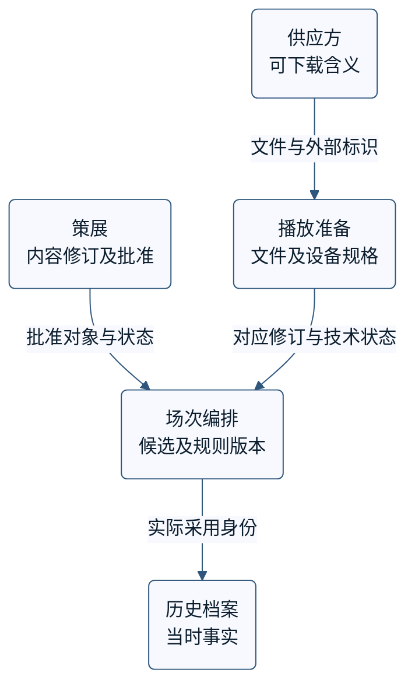

# 业务含义、上下文关系与模型演进

## 目录

- [1. 确定需要解决的含义冲突](#1-确定需要解决的含义冲突)
- [2. 用身份、状态和反例修正共同语言](#2-用身份状态和反例修正共同语言)
- [3. 从当前关系选择共享、转换或独立](#3-从当前关系选择共享转换或独立)
- [4. 从隐含要求形成可检查的规则](#4-从隐含要求形成可检查的规则)
- [5. 用业务价值和完整成本决定投入](#5-用业务价值和完整成本决定投入)
- [6. 协调共同设计与局部决定](#6-协调共同设计与局部决定)
- [7. 让模型变化覆盖旧数据与消费者](#7-让模型变化覆盖旧数据与消费者)
- [8. 形成有限决定并交接](#8-形成有限决定并交接)
- [9. 来源与采用范围](#9-来源与采用范围)

## 1. 确定需要解决的含义冲突

本方法用于相同业务词语在不同位置产生不同结果、模型开始掩盖重要规则，或多个负责方需要共同改变含义的任务。先明确这次需要决定的行为、输入和受影响使用者；不能从书籍推出当前项目已经存在设计缺陷。只需统一一个标签、且身份、规则和责任实际相同时，直接澄清即可，无须拆模型或增加服务。需要比较运行边界时，另用[架构方法](architecture-drivers-tradeoffs.md)。

**上下文（Bounded Context）是一个模型的词语、身份、关系和规则保持一致的适用范围。** 参与者依据实际业务行为、实现和协作确认这个范围，用它判断某项解释在哪里有效、跨出去需要怎样转换。一个上下文可以跨模块或团队，也可能有多个部署版本；一组服务共享数据库、同属一个团队，都不足以证明模型含义一致。外部系统也可能内部用词不一致，不能把供应方名称当作已核实边界。来源 DDD-R1。

开始时取得足以区别候选的材料：相同词语的实际例子、身份及修订、状态由谁产生、结果要满足什么规则、谁使用这些结果，以及各方能否协商变更。缺少决定性材料时，保留竞争解释和下一项证据，不把组织图或类名补成事实。具体比较步骤属于适配 A1。

### 1.1 原创题设与已知范围

以下天文短片场次编排完全虚构，用于静态推导。策展批准内容，播放准备核查文件，编排形成候选，档案保存过去实际采用的身份。题设只规定馆内业务和技术责任，不提供实际放映、发布或人员操作权限。

初始规则 **R1**：针对展厅 H1、观众组 `family` 和设备规格 P1，每段精确内容修订必须处于批准状态；文件必须对应该修订且对 P1 技术就绪；整场总时长不超过 360 秒。缺少必要证据不能默认满足。时长是本题给定的精确秒数。

| 片段 | 内容与批准 | 文件及技术就绪范围 | 时长 | 是否终场提示 |
|---|---|---|---|---|
| A | A 修订 3，对 H1、family 已批准 | F-A3，对 P1 就绪 | 180 秒 | 否 |
| B | B 修订 2，对 H1、family 已批准 | F-B2，只给出对 P2 就绪的证据 | 210 秒 | 否 |
| C | C 修订 1，对 H1、family 已批准 | F-C1，对 P1 就绪 | 120 秒 | 是 |

规则 R2、关系反例、内容修订和时长变化将在相应位置明确引入。它们是分开的假设分支，不把互不相干的变化累加到初始快照。实际设备是否可用、检查多久有效及既有未播放候选如何处理，均尚未取得现实证据。

## 2. 用身份、状态和反例修正共同语言

### 2.1 相同词语为什么不能直接共享一个字段

先让不同使用者用同一个具体输入说明“发生了什么、还缺什么、下一步允许什么”，再比较表达。词表可以帮助发现问题，但双方都写“素材可用”不证明含义相同。来源 DDD-L1、L2；下表为适配 A1。

| 使用范围 | 要识别的对象 | 状态说明的事实 | 不能推出的结论 |
|---|---|---|---|
| 策展 | 内容标识、内容修订、展厅、观众组 | 该修订待审、批准或撤回 | 对应文件已经存在或技术就绪 |
| 播放准备 | 文件标识、内容标识、内容修订、设备规格版本 | 文件未取得、检查中、就绪或不兼容 | 内容已经获准用于指定观众 |
| 场次编排 | 候选及修订、展厅、观众组、规则版本 | 当前输入下整场是否满足规定 | 以后输入变化仍满足，或已实际放映 |
| 历史档案 | 场次、实际内容修订、实际文件、当时规则 | 过去实际采用了什么 | 今天仍获准使用或适合当前设备 |

A 与 C 合计 `180 + 120 = 300` 秒，给定输入满足 R1。A 与 B 合计 390 秒，已知超过上限；同时没有 B 对 P1 就绪的证据。不能把 P2 就绪直接推为 P1 不兼容，也不能以“策展都批准了”消除超时和缺证两个问题。

再改变一个前提：批准记录改指 A 修订 4，但仍只有 F-A3。该批准记录不能证明修订 3 文件符合所需批准；相同的内容标识没有消除修订差别。若 C 的批准状态变为未知，文件可下载或曾获批准也不能补出当前依据。反例迫使模型保留**批准对象**与**可播放对象**的区别，而不是只把 `approved` 改名为 `available`。

### 2.2 不把发现的区别扩大成多余拆分

目前需要保留不同状态的来源和责任，但还没有据此决定几个服务、数据库或团队。可以在一个程序中维护这些明确的模型与转换；也可能因现实协作需要分开部署。后者仍需运行、恢复和维护成本的证据。

反过来，若两处实际共享相同身份、规则和变更责任，只是界面标签不同，一个模型或普通模块可能足够。先尝试用共同场景消除误解；若仍有合理的不同解释，再判断是否属于不同适用范围。不能为了减少重复而强迫不同业务含义合并，也不能为了展示上下文而拆开已一致的模型。来源 DDD-R1、R2；具体反例为适配 A1。

### 2.3 组合视图可以成立，但要公开它的含义

供应方的 `available` 只表示当前可下载。直接显示绿色“可放映”的 UI0 方案不成立，因为还缺策展批准、设备就绪和整场规则。

UI1 则可以在明确输入及规则快照下组合结果：全部必要条件有证据满足才显示“可放映”；存在已证不满足显示“不满足”；没有已知失败但缺必要证据显示“未确认”。界面允许查看具体状态和版本。组合视图因此可以保留，不要求把所有状态放入同一可写模型。

这个判断次序属于工程适配：一项确定失败已足以否定当前候选，其他未知仍须保留；没有失败也不等于证据齐备。UI1 只定义题设中的共同含义，尚未解决快照有效期、运行故障显示或变化后的重新判断，不构成实际可放映保证。

## 3. 从当前关系选择共享、转换或独立

### 3.1 先记录当前含义依赖

上下文关系图（Context Map）记录现有模型在何处接触、依赖什么含义以及谁负责转换。先画已核实关系，再另列目标变化。下图只表达题设给出的信息依赖；箭头不是网络调用或发布顺序，也不表示这些范围必须分开部署。来源 DDD-R2；图的具体组织属于适配 A1、A3。

图中的“实际采用身份”是档案所需信息，不表示候选检查通过已经发生实际放映。对应事实未取得时，历史记录不能填为已使用。供应方与内部对象的对应关系也必须核实，不能仅靠文件名猜测内容修订。

### 3.2 在同一需求下比较三个候选

| 候选 | 能减少什么工作 | 新增或保留什么责任 | 对当前题设的判断 |
|---|---|---|---|
| 共用一个可写素材模型 | 少一些转换，查询形式统一 | 不同状态及修改者相互影响；每次变更可能需要更广协调 | 若混成一个布尔字段会丢含义；扩大字段也不能自动解决责任冲突。只有含义与共同维护条件确实一致才考虑共享 |
| 各范围保持明确模型，在接触处转换 | 各自状态和规则可清楚演进 | 维护身份对应、转换失败、版本兼容及跨范围检查 | 当前同名不同义支持优先展开此候选；它是模型组织判断，不是增加网络组件的理由 |
| 隔离或放弃供应方依赖 | 避免不值得承担的转换和协调 | 必需功能仍须由其他可靠途径满足；以后接入仍可能有成本 | 只有不需要相关交互或另有满足业务的办法时成立，不能删除必要输入后声称完成 |

初步选择要能被反证。例如同义标签分支会提高第一个候选的吸引力；若供应方模型本来准确满足本方需要，跟随它可能比维护转换更便宜；若需要大量特殊语义且供应方不合作，转换的长期成本也可能促使放弃接入。不是先决定“隔离最好”，再故意弱化其他候选。来源 DDD-R4—R8、C2；比较方式为适配 A4。

### 3.3 合作条件决定可以共享多少

以下名称描述模型间的关系或维护方式。应先取得表中的条件，再用名称简化沟通，不据名称认定合作已经发生。

| 方式 | 成立所需条件 | 本题怎样判断与复查 |
|---|---|---|
| Shared Kernel，有限共享部分 | 双方只对必要模型和实现共同负责，能协调变更并检查双方影响 | 若只共享少量稳定设备规格，先写清这些内容及共同修改责任；不要顺手把全部素材状态加入公共库 |
| Customer/Supplier，上下游协商 | 上游实际接受下游需求、协商优先级、形成承诺并定义受影响检查 | 有明确排期与联合验收承诺时可以讨论；同一上级、友好回复或调用箭头都不是充分证据 |
| Conformist，跟随上游模型 | 上游配合有限，但其含义满足本方需要，跟随的代价可接受 | 比较减少的转换与受限的演进；`available` 不等于批准的当前分支不能直接照搬，含义相符的反例分支则可能成立 |
| Anticorruption Layer，隔离含义转换 | 两边含义不同，依赖仍值得保留，本方能够承担转换维护 | 将可下载状态、内容对应和技术检查分开；简化接口、协议适配及语义转换是职责，不强制建立三套类 |
| Separate Ways，保持独立 | 两项功能确实不需要相关数据或行为交互 | 共用菜单不是集成理由；编排实际需要批准和技术状态，不能套此方式删掉这些必要关系 |
| Open Host Service，公共访问能力 | 多个消费者需要一组稳定、内聚的能力，维护方愿意承担兼容责任 | 先核实消费者与共同需要，单次接入不直接升级为通用平台 |
| Published Language，明确的交换语言 | 各方可以依据共同定义解释交换的数据与行为 | 写清对象身份、修订、单位、状态及未知；JSON 或 XML 格式本身不能提供这些含义，也不应暴露整个内部模型 |

当前供应方没有协作承诺，因此不能按期望把它标成 Customer/Supplier。可以先针对确有需要的接口维护有限转换；如果新的合作证据出现，再比较关系变化。Shared Kernel 的共同检查针对共享部分，不是要求全员批准所有实现。来源 DDD-R4—R9。

### 3.4 让转换具有可检查的方向与失败含义

供应方可下载结果进入本方后，最多证明获取条件，不能直接填策展批准或设备就绪。转换需要保留供应方标识、内部内容修订、文件身份和采用的接口版本；对应关系不明确时，返回未能确认的结果，并让依赖该事实的判断保持未确认。具体错误类型遵守当前接口习惯。

同一内容修订可以对应多个设备文件，因此从内部内容标识不能唯一恢复供应方文件。需要反向操作时，另行保存其所需身份或明确不支持；不能把正向转换函数倒过来就宣称可逆。局部协议适配成功，也不证明两个模型的业务含义一致。来源 DDD-R2、R7。

检查至少覆盖一个同义转换、一个不相等的含义和一个无法转换的输入。预期来自双方明确约定及独立推导，不能只让同一转换代码往返一次。实际连接、替身和版本绑定复用[测试方法](test-risk-oracles-layers.md)与[交付方法](artifact-promotion-evidence.md)；没有接入运行时，只能报告静态含义已说明。

## 4. 从隐含要求形成可检查的规则

### 4.1 让失败场景揭示缺少的概念

在 R1 下，只有 A 的候选满足已给定条件：180 秒、批准和技术就绪都齐备。不能因为题设标记 C 为终场提示，就预先添加“每场必须有提示”的规则。

后来工作人员提出“每段都合格，但整场结束时缺少提示”。这只是需要核实的新要求，不是已经存在的缺陷结论。题设策展负责人随后确认 **R2**：继承 R1，整场恰有一段明确标记的终场提示，并且该片段位于最后；它用于启用后的新候选。已有未播放候选怎样处理仍未决定。

新证据改变的是**整场编排条件**。把每段设成 `valid=true` 无法表达“恰有一段”及“位于最后”；在素材类中新增一个通用 `ready` 也没有解决作用范围。此时应分别命名“片段适用”与“整场满足规则”，并使讨论、行为说明、相关实现和必要文档同步。来源 DDD-L2、L4、L5。

### 4.2 先表达规则，再决定是否需要对象

简单明确时，使用有意义的函数已经足够。例如片段适用函数接收内容批准、对应文件、目标展厅、观众组和设备规格；整场函数接收有序片段与规则版本，检查总时长及 R2 的整体条件。输入和输出应保留失败依据与缺证，避免函数内部偷偷读取无法说明版本的全局状态。这是本题的实现建议，不是原书规定的函数签名。

**Specification 是对候选应满足条件的明确表达。** 业务负责方确认条件，程序通过相应实现用它验证候选、选择候选或指导生成；当规则成为独立变化、重复且有意义的职责时，可用独立规则对象组织。它不因使用某个类名就成为完整模型，也不保证不同执行方式自动一致。来源 DDD-L5、L6。

| 当前需要 | 可先采用的表达 | 何时值得改变 |
|---|---|---|
| 单一入口、条件短且稳定 | 明确函数及有版本的输入 | 条件开始隐藏主体职责，或不相关数据不断进入该主体 |
| 多个入口确实共享同一业务条件 | 集中定义规则含义，可配独立规则对象 | 必须确认复用的是相同规则，而非同名的不同条件 |
| 大量记录需要查询筛选 | 数据查询表达可执行的必要条件，再按完整规则检查 | 比较数据量、查询能力、转换与剩余检查成本；粗筛不能误删应保留的候选 |
| 需要构造满足规则的候选 | 将目标条件与生成策略分开 | 搜索限制、性能和失败后状态需要单独处理，不能把规则对象当求解器 |

选择、验证和生成可以使用不同实现，但必须指向同一个适用版本的含义。把数据库字段遍布业务规则会让存储变化扩散；把全部数据加载到内存再逐项判断也未必可行。先根据当前规模和能力选择必要实现，不为三个片段建设规则引擎。来源 DDD-L5、L6、C4。

### 4.3 对相同事实分别推导，保留未知

| 候选与规则 | 由题设独立推导的结果 | 排除的错误解释 |
|---|---|---|
| A，R1 | 满足初始条件 | 不能提前套用尚未确认的 R2 |
| A，R2 | 缺终场提示，不满足 | 单段技术就绪不代表整场满足 |
| C、A，R2 | 唯一提示不在最后，不满足 | 有提示不等于位置正确 |
| A、C，R2 | 300 秒，唯一提示在最后；同一快照下满足 | 通过不延伸到新修订或未来设备状态 |
| C、C，R2 | 两段提示，不满足；总长虽为 240 秒 | 满足时长不能抵销另一项失败 |
| A、C，C 批准未知 | 没有足够依据宣称满足 | 下载成功、历史通过或默认布尔值不能补证 |

边界另取独立分支：C 修订 2 已获同样适用批准，对应 F-C2 对 P1 就绪且为终场提示，时长 180 秒；与 A 组成 360 秒候选，满足给定条件。另一个分支中 C 修订 3、F-C3 同样具备所需证据，但时长 181 秒，总计 361 秒，因此不满足上限。这两个版本不加入初始生成池，也不改写初始 C 修订 1 的 120 秒。

### 4.4 生成失败为什么不等于没有解

固定生成池只有 A、B、C，每段最多使用一次，候选最多两段。一个试探策略先选时长最长的两个片段，只尝试一次，因此得到 B、A。它既超时又缺终场提示，还有 B 对 P1 的缺证；失败是这个策略在当前尝试下的结果。

A、C 却满足 R2。这个明确反例已经足以否定“本池没有可行候选”。只有穷尽已明确的搜索空间，或取得适用的证明，才能据此作无解结论；一次超时、一次启发式失败都不够。这里也没有比较所有候选的优劣，不声称 A、C 最优。来源 DDD-L7；具体反例属于工程适配。

可以先在独立候选值中构造并验证，成功后再交给后续步骤，避免搜索途中破坏已有候选。若实际实现会修改共享状态，失败后的恢复、遗留结果和后续操作必须另行定义，不能假设调用失败自动撤销。相同谓词同时用于选取和验证，只证明两条路径共享判断；正确含义还需固定题设、反例和独立预期支持。具体检查设计见[测试方法](test-risk-oracles-layers.md)。

为了讨论 UI1，可以先用界面原型展示不同状态及缺证，允许省略与这个问题无关的技术接入；所省略的设备和真实查询不能被宣称已验证。为说明规则制作的图表或原型也可以不同于程序对象结构，但要标清对应含义。即使程序已经符合 R1，也不能由此证明业务永远不需要 R2；规则是否表达实际需要与程序是否遵守规则是不同问题。来源 DDD-L2、MMM-N2。

## 5. 用业务价值和完整成本决定投入

### 5.1 核心是什么，由当前目标决定

本题的差异化价值是可解释的观众适用与场次组合。可以先用这句话说明投入重点，并标出实现这一能力的关键概念、规则和关系。文件取得、基础编解码和档案存储是支持能力，但它们失效仍会损害正确性和可用性，不能因为“非核心”就省略必要检查。来源 DDD-C1—C3。

核心身份可以改变：若给定目标变为提供独有的自动组片能力，组合算法本身可能承担核心价值。不能按类名、是否涉及金额、是否计算密集或技术是否新颖永久分类，也不能推导核心永远不得采购、必然保密或必须由某个人实现。

### 5.2 比较需要承担的全部工作

| 候选 | 当前可取之处 | 必须算入的投入与限制 | 会改变选择的证据 |
|---|---|---|---|
| 全部自建 | 可以针对已理解的特殊行为设计 | 实现、验证、运行、维护和知识保持；不能把控制权当免费收益 | 现成能力是否无法满足关键要求，团队是否具备持续维护能力 |
| 采购或复用支持能力 | 可能减少已有通用功能的重复开发 | 查找取得、功能适配、语义学习、版本兼容、验证、运行与退出 | 相同术语下的实际行为、缺少能力、升级与恢复条件 |
| 先保留简单明确选择，只自动化已理解规则 | 早期投入较小，能暴露规则不清之处 | 人工步骤的容量、差错和交接负担；不能绕过 R1/R2 | 当前来量与风险是否允许，自动化具体减少哪项成本 |

在本题没有供应报价、来量和性能证据时，不编造总成本排名。可以选择下一项最能改变判断的核查，例如现有组件是否保留内容修订、能否区分 P1 与 P2，以及需要多少转换。通用概念也不要求建设万能重用框架。来源 DDD-C2、MMM-N3；比较步骤为适配 A4。

### 5.3 不把局部速度写成总体收益

虚构反例固定原工作为 10 小时，其中目标部分 3 小时、其他部分 7 小时。若目标部分加速 3 倍且无新增开销，结果为 `3 / 3 + 7 = 8` 小时，整体加速仅 `10 / 8 = 1.25` 倍。若另有学习、适配、返工或额外检查，实际投入还会改变。

这个计算只在工作组成、质量和其他投入固定时成立。它没有测量任何现实工具，也不能用书中的历史工作比例补全当前比例。先识别改进减少的是表达实现、需求理解还是某种协调，再观察剩余工作和完整结果。关于整体与分组、实际与名义投入的比较，复用[协作方法](collaboration-trust-reversible-improvement.md)。来源 MMM-N1；数字及计算属于本题适配。

### 5.4 让简化和重构有明确对象

可以将“什么条件算满足”的业务规则与“怎样尝试组合”的内聚计算分开，便于分别修改和检查。需要跨越的接口必须保留有序候选、规则版本、失败与未确认的含义；搜索实现不应偷偷重定义终场条件。分离也会增加参数、转换和协作，若相互变化高度关联且成本大于收益，可以重新组织，仍保留清楚职责。来源 DDD-C4。

若一个高引用的 `Material` 类混合了所有状态，仅把它搬到名为 core 的目录不会提炼核心。先标清被谁使用、哪些概念真正稳定、哪些改变必须一起发生，再比较局部修正、有限共享或分步拆开。核心抽象必须能帮助说明实际交互；没有真实需要时不全面重写。现状的错误和理解成本也要纳入比较，不能因为修改有成本就永远不改。来源 DDD-L8、C3、C5、MMM-S2。

## 6. 协调共同设计与局部决定

### 6.1 决定对象不同，最终责任也应明确

共同建模需要业务与实现反馈，用户又需要理解一致的产品行为。这不要求所有人投票决定全部细节，也不能推导某个总体设计者有权批准所有内容、人员安排或代码。Brooks 的集中设计责任与 DDD 的共同建模不完全相同；以下分工是适配 A2，而非宣称两书给出同一组织制度。来源 DDD-L3、MMM-M1—M3、MMM-S1。

| 决定对象 | 本题最终负责角色 | 必要反馈与不能代替的责任 |
|---|---|---|
| 观众适用、内容批准及 R2 条件 | 策展负责人 | 实现者报告代价和歧义；技术就绪不能代替内容批准 |
| 已明确技术要求内的文件检查及本地实现 | 播放准备负责人 | 及时反馈成本超限、无法满足和接口影响；不能自行放宽业务规则 |
| 在上述含义内的共同用户状态和跨接口表述 | 总体设计负责人 | 相关维护者核对状态是否准确使用；不能替策展方批准内容或忽略技术限制 |
| 跨出当前授权的规则、投入或责任变化 | 当前有权作相应决定者 | 先取得其决定；Skill 不自行任命角色，也不把沉默视为同意 |

具体走一遍：策展负责人确认 R2 只用于新候选，播放准备负责人确认 P1 就绪对应精确文件与设备规格。总体设计负责人据此记录 UI1 为后续设计依据，保留独立状态、输入身份和修订；两位专业负责人确认本方含义被准确使用。这完成的是共同含义的有限决定，没有同时证明性能、可容忍陈旧程度或设备能力。

### 6.2 用实现反馈改变选择，而不夺走实现责任

技术方可以提出实时读取或带版本快照。比较它们是否表达 UI1、怎样识别输入变化及失败，而不是只接受总体设计者最初想到的算法。实现估计超出约束时，也可以建议缩小功能或调整方案；业务需求是否改变，仍由相应负责角色决定。来源 MMM-S1、DDD-L3。

若为了降低查询成本而提出放宽批准有效期，这已经影响业务条件，需要策展负责人决定。没有回应时，保持该事项未知，停止依赖这项放宽的承诺；无关的本地实现准备仍可继续。不能暗定一个 TTL，也不能用“团队自主”跳过决定。记录快照同样不赋予沿用过期批准的权利。

状态含义、输入身份、R2 适用或消费者依赖改变时重开相应决定。只修改不改变约定的内部实现，则按现有范围完成必要检查即可，不要求重新审议所有模型。调用者需要理解接口详细含义，提供者可以隐藏不必共享的实现；信息隐藏不是禁止必要沟通。来源 MMM-M3、DDD-R3。

### 6.3 同时保持语言和实现的一致

讨论新的例子时检查双方预期是否相同，再把决定落实到相关实现、说明与检查。合并代码和构建通过不能独立证明同名状态含义一致；仅开会统一词表也不能证明实际代码已经改变。对共享部分维护共同检查，对不同模型验证必要转换，两者可以同时存在。来源 DDD-R3、MMM-I1。

逐步得到可运行部分能够较早取得反馈，但必须说明哪些真实依赖尚未接入、使用了哪些替代、结果适用什么版本。历史材料对阶段发布和后来增量构建的表述存在张力，不能据此强制每日一次或“大批次总更好”。采用何种构建、集成和产品发布频率，应依据当前依赖和检查能力分别决定。具体路径使用[交付方法](artifact-promotion-evidence.md)。来源 MMM-I2、I3。

## 7. 让模型变化覆盖旧数据与消费者

### 7.1 字段存在不表示含义可以恢复

旧模型只有 `material_id` 与 `approved`，没有说明布尔值表示策展批准还是技术就绪。模型演进首先要承认已经丢失的信息，而不是给新字段填默认成功。来源 DDD-R10；旧数据处理为适配 A3。

| 旧记录 | 还能核实什么 | 可形成的有限结论 | 继续缺少什么 |
|---|---|---|---|
| O1：A，`approved=true` | 只找到 F-A3 对 P1 的技术检查记录 | 可以重建该文件、该规格的技术准备事实 | A 修订 3 对 H1、family 的策展批准；不能由 true 补造 |
| O2：C，`approved=false` | 原因与适用修订缺失 | 保留未知，查找相应负责方和原记录 | 不能推断内容撤回、文件不兼容或具体失败原因 |

如果后续取得某项批准原记录，可以补足它支持的精确范围，并保存来源与版本；未取得的部分仍保持未知。历史事实与当前判断分别保存，不能因新规则要求终场提示就重写过去实际播放内容。

### 7.2 从当前模型走到目标模型

| 阶段 | 要完成的具体工作 | 允许继续的依据与停止条件 |
|---|---|---|
| 明确现状 | 记录字段实际含义、使用者、身份、已知错误及未决政策 | 尚不能区别批准与就绪时，不批量制造新批准记录 |
| 定义新表达 | 明确独立状态、对应修订、规则版本和缺证结果；分类 O1/O2 等旧记录 | 新表达能保留已知事实和未知；新字段数量不等于完成 |
| 限定并存 | 新输入采用明确模型；旧消费者使用有依据的兼容转换，比较两边共同能表达的部分 | 差异按含义分类；不能要求全部字段相等，也不能吞掉旧字段无法表达的新状态 |
| 处理使用中工作 | 找齐需要继续使用的旧记录、未播放候选、消费者和历史保留要求 | 已排未播候选受 R2 或撤回影响的政策尚缺时，相关推进不能宣称已解决 |
| 退出旧表达 | 核对必要旧记录已补证或明确排除使用，消费者已迁移或有确认的兼容办法 | 相关责任和规则已经决定，历史身份保留；仅新版本上线不是退出证据 |

从多个模型变成有限共享时，同样要协调哪些含义共同维护、何时切换以及旧接口如何结束；从共享模型转移职责时，则要明确新负责方何时能承担必要行为。不能只从目标图倒推现有合作能力已经具备。来源 DDD-R10、C5；具体步骤为适配 A3。

### 7.3 恢复旧程序不等于恢复业务含义

旧布尔值不能表达新状态，因此把旧程序重新部署并不自动构成完整回退。需要先判断新期间产生了哪些事实、旧版本会误读什么、哪些进行中工作仍有人负责，以及是否应向前修复、保留兼容表达或暂停相关使用。未确定 R2 对旧候选的政策，不能由数据库回滚代作业务决定。

技术实施中的混合读写、回填、并发、备份与恢复，继续使用[混合版本迁移方法](mixed-version-data-migration.md)。本方法只交付含义与影响判断，不假设跨系统原子性或自动撤销。具体事务与聚合边界可转[聚合与事务方法](invariants-aggregates-transactions.md)；上下文选择不能直接决定所有事务范围。

## 8. 形成有限决定并交接

需要记录的不是一整套术语，而是足够让下一位参与者正确行动的信息。

| 交付项 | 本题可以明确的内容 | 保留的未知或下一项证据 |
|---|---|---|
| 当前含义与范围 | 批准、技术就绪、候选判断、历史事实分别对应什么身份 | 实际系统中是否确有这些区别，需要当前证据 |
| 选择及可替代条件 | 优先展开明确模型与必要转换；同义标签及合理跟随上游时可简化 | 合作承诺、转换成本与消费者数量不能猜测 |
| 规则与反例 | R1/R2、300/390 秒、终场顺序、360/361 边界和生成失败反例 | 启用 R2 后既有未播放候选如何处理 |
| 决定责任 | 题设内专业规则、局部实现和共同状态的最终责任；UI1 是有限决定 | 实际权限、投入约束及改变规则的决定 |
| 演进与证据 | O1/O2 的可恢复事实和未知，必要消费者、并存与退出条件 | 快照有效期、设备反馈、运行与恢复验证 |

当前可以继续明确新候选的静态规则，不能承诺已有候选全部完成迁移或系统已经可放映。若任务只需要解释一个同名字段，交付相应含义、反例和待确认事项即可；不强迫用户完成全部模式比较。

后续参与者需要能找到当前说明，理解输入、规则和权限版本，并知道未知该交给谁。保存了一张图、安排了一次培训或采用了新工具，都不证明已经具备这些能力。设计能力需要指导和使用反馈；为学习、支持和交接保留必要投入，不按书中历史倍率排名个人。来源 MMM-N4；知识延续细节复用[协作方法](collaboration-trust-reversible-improvement.md)。

本篇没有展开业务逻辑组织方式、完整持久化或跨会话并发。选择 Transaction Script、Table Module、Domain Model，以及对象身份、Unit of Work 和映射，需要相应来源及方法，不能由本例自动推出。

## 9. 来源与采用范围

DDD 采用项目保存的 Eric Evans 著作中文 2010 年 11 月第 1 版 PDF，原著版权为 2004 年。下表为**文件页**，不能直接当印刷页；指定范围中只采用已核读的原则，代码、表格和图形关系不作新的精确依据。原件文件页 102 的正文缺失不在本篇采用范围内。

| 来源标识 | 文件页或 EPUB 内部定位 | 有限采用 |
|---|---|---|
| DDD-L1、L2 | 文件页 38—40、45、48—49 | 共同语言、模型与解释表达、含义变化 |
| DDD-L3 | 53—54、61—62 | 业务与实现双向反馈及共同建模 |
| DDD-L4、L5 | 162—175 中已登记段落 | 从语言和行为发现概念，先表达约束，再判断职责 |
| DDD-L6、L7 | 177—189 中已登记段落 | Specification 的用途差别、生成条件与实现限制 |
| DDD-L8 | 249—252 | 依据理解与变化成本进行模型重构 |
| DDD-R1—R3 | 258—270，以及 291、293 的相关段落 | 上下文含义、当前关系和持续一致；不按部署推断范围 |
| DDD-R4、R5 | 271—275 | 有限共享与实际上下游合作 |
| DDD-R6、R7 | 275—281、291—292 | 顺应、转换与依赖取舍；语义隔离不等于传输设施 |
| DDD-R8、R9 | 282—285、298 | 独立关系、公共访问和交换语言 |
| DDD-R10 | 290、293—298 | 关系演进、逐步共享与职责转移；不是完整生产迁移计划 |
| DDD-C1—C3 | 299—313 中已登记段落 | 价值重点、支持能力取舍、简短说明及关键概念 |
| DDD-C4、C5 | 314—319、323—324 | 内聚计算、核心抽象和协调成本 |
| MMM-M1 | `OPS/chapter16.html` 节点 `[7,38)`、`[45,59)`；`chapter31.html` `[18,26)` | 用户概念一致性与明确设计责任 |
| MMM-M2、M3 | `OPS/chapter31.html` `[26,42)`、`[115,128)`、`[150,164)` | 用户假设、适当自主、信息隐藏修正及接口含义 |
| MMM-S1、S2 | `OPS/chapter17.html` `[9,38)`；`chapter31.html` `[75,79)` | 成本反馈、实现责任与重设计取舍 |
| MMM-I1—I3 | `OPS/chapter25.html` `[10,62)`；`chapter31.html` `[62,115)` | 组件假设、有限集成、版本与后期增量观点 |
| MMM-N1 | `OPS/chapter28.html` `[2,44)`；`chapter29.html` `[12,36)`、`[46,57)` | 工作性质、可改善复杂性及历史预测边界 |
| MMM-N2、N3 | `OPS/chapter28.html` `[100,105)`、`[115,139)`；`chapter29.html` `[75,80)`、`[94,123)`；`chapter31.html` `[109,115)` | 原型与验证范围、采购和复用成本 |
| MMM-N4、V1 | `OPS/chapter28.html` `[41,44)`、`[95,100)`、`[139,156)`；`chapter29.html` `[62,67)`、`[84,94)` | 能力学习建议与多视图的有限用途 |

《人月神话》采用二十周年纪念版 EPUB。表中的 `chapter*.html` 是内部文件名，不是印刷章号；节点从 0 起计数，使用左闭右开范围，对应保存正文树 `body/div` 的直接子节点。

Brooks 确实主张一人或少数架构者承担设计责任，后记没有撤回这一人数倾向；本篇不把它移作通用组织处方。作者对信息隐藏的早期观点有明确修正。关于十年生产率预测、固定经历、软件价格、复用比例、每日构建和卓越人员倍率，均保留历史背景，不作为当前阈值，也不据书中 AI 讨论判断当前产品收益。

适配 A1 是身份、状态、规则与例子的比较步骤，依据 DDD-L4、R1、R2；A2 是不同决定对象的责任协调，综合 DDD-L3、R10、C5 与 MMM-M1—M3、S1；A3 是旧数据、消费者、并存及退出的处理步骤，依据 DDD-R10 并连接既有迁移方法；A4 是业务收益、未知和完整成本比较，依据 DDD-C1—C5。全部天文短片题设、计算、UI0/UI1、规则版本、职责安排和分步推演均属原创工程展开，不是原书案例或原句。

视图只表达所选择的关系，不能替代规则、例外和实际证据。原型和题设检查只支持其包含范围；本篇提供静态方法，未执行真实项目、书例或 Skill 行为评估。来源 MMM-V1、N2。
