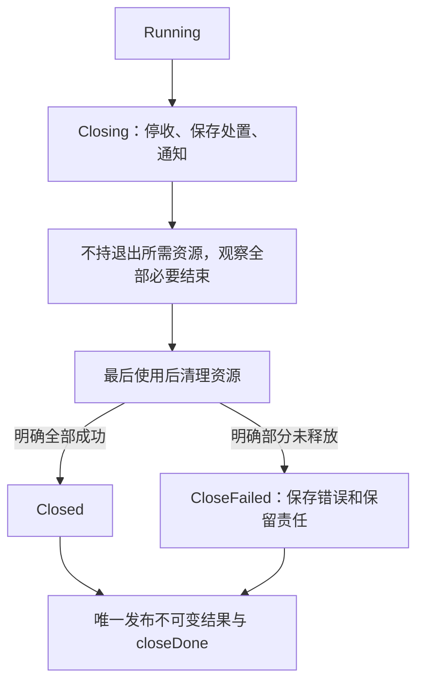

# 共享状态、发布可见性与关闭责任

## 目录

- [1. 从本次决定选择分析范围](#1-从本次决定选择分析范围)
- [2. 列全状态、访问者和完成责任](#2-列全状态访问者和完成责任)
- [3. 保护完整检查和修改](#3-保护完整检查和修改)
- [4. 连接初始化发布并检查内部别名](#4-连接初始化发布并检查内部别名)
- [5. 确定锁范围和资源获取次序](#5-确定锁范围和资源获取次序)
- [6. 连接等待条件、登记与通知](#6-连接等待条件登记与通知)
- [7. 让接收与关闭形成完整责任](#7-让接收与关闭形成完整责任)
- [8. 分开取消、超时、退出与最后使用](#8-分开取消超时退出与最后使用)
- [9. 核对 Go 通道和 select 的边界](#9-核对-go-通道和-select-的边界)
- [10. 用危险交错选择验证](#10-用危险交错选择验证)
- [11. 交付决定与停止条件](#11-交付决定与停止条件)
- [12. 来源与有限采用范围](#12-来源与有限采用范围)

## 1. 从本次决定选择分析范围

共享状态是多个执行者能够读写或通过别名到达的同一数据。并发方法要回答三个相互关联的决定：哪些检查与修改必须一起保护，初始化和最终结果怎样对其他执行者可见，以及停止时哪些工作、等待者和资源责任仍未结束。单次容器操作线程安全，只说明其声明的操作范围。来源 S02–S04、S06、S10、S12。

已有共同可达的可变字段、后台工作、阻塞等待或资源借用时，按本次问题加载相应章节。只有调用栈内的局部数据、没有外传可变引用或后台工作的顺序计算，先检查输入、边界与结果即可。固定入口 SS-00 中，L 顺序读取局部 `[2,3]` 得到 5；另一个入口中 P、C 同时可达 `sharedCache`，P 填充 `tiles`，C 根据 `ready` 使用它，才需要分析发布及后续写者。入口判断识别需要的分析，不凭书籍或项目支持并发就认定当前实现有故障。来源 S03、S04；适配 A08。

先定义这次要作的决定及观察范围，例如“容量一的接收是否会超过一项”“调用 Close 后哪些参与者还可能使用输出资源”“取消以后是否仍能提交效果”。复用[不变量方法](invariants-aggregates-transactions.md)描述有效状态，复用[接口责任方法](module-responsibilities-contracts.md)定义接收、失败、所有权及结果含义。数据库事务、同根版本或不可变输入可以解决各自范围的问题；进程内发布仍要有目标语言规定的同步关系。

下文各例给定具体初态、参与者、同步与依赖假设，各分支从自己的初态独立复位。所述状态、允许结果和不可保证事项属于静态推导，未执行程序。静态反例证明所列交错存在问题，正向路径说明给定条件下可到达相应结果，都不穷尽所有调度；实际验证范围见第 10 节。

## 2. 列全状态、访问者和完成责任

不变量是必须共同成立的状态关系，并要明确它在哪些观察或响应位置成立。先列关系，再沿所有会改变它的入口寻找访问者：正常接收、取消、完成、失败、清理、配置更新及旁路调用都可能改变相同事实。只检查某一个有锁类，容易漏掉锁外读者和内部引用的写者。来源 S04、S07、S17、S18；适配 A01、A04。

| 对象 | 需要记录的事实 | 会改变判断的遗漏 |
| --- | --- | --- |
| 共享字段与别名 | 初态、全部读写者、内部引用、可变对象及访问入口 | 外层副本仍指向同一数组；旁路写者没有取得同一锁 |
| 组合条件 | 必须一起成立的字段、成功响应条件、一致读取位置 | 余量已扣减但工作未登记，读者发布中间状态 |
| 接收和在途工作 | 稳定工作身份、Queued/InFlight、责任者、当前结果 | 队列已空，但取走的工作仍在处理 |
| 等待 | 等待者、共享谓词、等待对象、通知者及失去通知者的时点 | 只通知消费者，满队列的生产者仍睡眠 |
| 资源 | 获取者、拥有者、借用者、转移点及最后必要使用 | 直接调用者返回，异步借用者仍使用同一资源 |
| 结束观察 | 每份信号覆盖谁、何时发出、最终状态怎样发布 | 取消信号或一个工作者的 done 被当作全体结束 |
| 推进前提 | 可运行者能否取得执行、依赖能否结束、谁可释放等待资源 | 锁访问正确，但无人能走到通知或释放步骤 |

访问入口还可能藏在日志格式化、`equals` 或 `hashCode` 内。只有实际实现会遍历相关集合时，才把这次调用列为迭代访问，继续核对第 5.1、5.3 节的锁内调用、完整迭代与快照条件；这些方法名本身不证明发生了迭代。来源 JCIP-B1-C18。

同一提交接口可能在提交者线程直接运行任务，也可能先排队再交给其他执行者。改变执行策略前，分别核对任务是否重叠、前一任务的写入怎样对后一任务可见，以及任务是否依赖某个物理线程的局部状态。串行不重叠不自动提供所需可见性，也不承诺永久使用同一线程；线程复用或替换时，`ThreadLocal` 的内容不能直接当作当前任务的状态。运行位置还会改变提交者占用时间及回调次序，继续按[接口替换条件](module-responsibilities-contracts.md#72-签名相同不等于可以替换)判断。来源 JCIP-B2-C02。


把对象清单沿时间再检查一遍：构造期间谁能首次使用，发布时谁取得什么状态，发布以后哪些写者仍存在，以及移交或归还后哪些旧别名必须停止访问。容器结构与元素状态可以由不同责任者保护，引用可达不等于已经取得使用或释放权限。第 4.3–4.6 节用同一原创批次展开这些步骤；其 Java 来源条件与原 Go 保证分别核对。来源 JCIP-OWN-03、JCIP-OWN-05–JCIP-OWN-07。

原子性规定其他执行者能否在相关操作中间观察或介入；发布可见性规定哪些先前写入对接收者有依据地可见；推进规定等待能否解除；所有权规定谁能继续修改、借用或释放。对一种关系的证明不能替代另外三种关系。Go 的无数据竞争程序有文档所述顺序一致性，但独立原子步骤仍可破坏业务组合条件，安全访问也仍可永久等待。来源 S23、S24。

如果使用以下抽象监视器 M，明确要求：相关字段的所有读写在持有同一 M 时进行；M 互斥并提供所需解锁与后续加锁的可见性；`wait(M,V)` 将持锁条件检查与等待登记、释放 M 连接，恢复前重新取得 M；通知只使当前等待者有机会复查共享状态。它们是协议所需前提，不能由一个 API 名称自动推定。第 6 节另给 Go Cond 的有限官方保证。

## 3. 保护完整检查和修改

### 3.1 单步安全仍能超出容量

SS-01 初态为 `free=1, accepted=[]`，名额容量为一。P 提交 p，Q 提交 q，R 读取一致快照；可选旁路写者 B 也能改同一字段。必须保持 `0<=free<=1` 和 `len(accepted)+free=1`；返回 Accepted 时，工作已登记，拒绝工作不占名额。反例假定每次 Load、Add、Append、Snapshot 各自完整原子且无数据竞争，却没有覆盖整组操作。

| 顺序 | 执行者和动作 | 该步后的状态 |
| --- | --- | --- |
| 1 | P 读取 free=1，局部判断可以接受 | `free=1, accepted=[]` |
| 2 | Q 也读取 free=1，保存同样判断 | 两人都没有预留名额 |
| 3 | P 原子扣减 free | `free=0` |
| 4 | Q 按旧判断原子扣减 free | `free=-1` |
| 5 | P 登记 p 并返回 Accepted | `accepted=[p]` |
| 6 | Q 登记 q 并返回 Accepted | `accepted=[p,q]` |
| 7 | R 读取最终状态 | 两项被接受，容量被突破 |

这是 SS-01-a 的确定反例。问题来自两份判断都基于扣减前状态，不来自某一次 Add 自身不安全。只在修改时取得锁仍不足：P 锁外检查得到 1，B 随后接受 b，P 取得锁却沿用旧判断，仍得到 `free=-1, accepted=[b,p]`。SS-01-c 同时揭示保护范围和访问者清单不完整。来源 S02、S10、S16–S18；适配 A01。

### 3.2 用同一边界保护完整不变量

SS-01-b 从同一初态开始，全部访问者遵守 M。P 取得 M 后检查 `free>0`，仍持 M 将 free 改为 0 并登记 p；Q、R 只能等待，不能先读决定性字段。P 释放 M 后返回 Accepted(p)。Q 随后取得 M，复查 free=0，保持状态并返回 Rejected(q)。R 取得同一 M，一起读取两个字段，得到 `accepted=[p], free=0`。没有访问者能发布扣减与登记之间的中间状态。

以符合不变量的初态为起点，每次成功接收同增登记、同减余量；拒绝不改变名额，故保持两个关系。集中到一个服务操作可减少调用者遗漏，但 B 或清理入口仍必须参加同一协议。若实际接收涉及可失败分配，先定义失败不留部分登记的回滚或补偿；不能沿用本题无外部失败的步骤直接承诺完整原子结果。来源 S04、S10、S18、S23；适配 A01。

SS-01-d 单独复位为 `left=1,right=0`，要求二者之和为一。P 使用两个独立原子 Add 转移：left 先变为 0，R 在 right 增加前读到 `(0,0)`，P 才把 right 改为 1。事后总量正确不能修复已经观察到的错误组合。将转移及需要一致的读取纳入同一保护，或证明等效的完整状态协议；仅给每个字段加原子类型没有这样的证明。来源 S31。

锁、原子整体状态、单一责任执行者等候选都须覆盖检查、决定、保存、响应和需要一致的读取。选择成本和边界适合当前任务的候选，再核实其实际语义；不能把 CAS、事务或“线程安全”字样视为完整证明。临界区之外的远程处理不能参与这里的原子修改，接收责任需先保存，后续按第 7 节继续管理。

### 3.3 让同键调用等待同一份进行中计算

进行中计算记录保存某次计算的身份，以及尚未完成或已形成的结果状态。同键调用只有在输入一致、结果允许复用且必要副作用已经定义时，才可共享这份记录。按第 3.2 节在同一保护边界内选定当前映射中的胜出记录，再由取得启动责任的一方安排计算；其余调用者等待该记录，不运行自己未胜出的计算。只在算完后缓存结果，或先查为空再分别放入记录，都可能让同键调用重复计算。等待还须核对第 4 节的结果可见性和第 5 节的执行资源依赖。来源 JCIP-B1-C29。

等待者超时或取消自己的等待，不自动赋予它取消共享计算的权限；谁有权取消共享计算，须由计算拥有者的约定决定，并按第 8 节核实实际退出。失败或取消的记录要保留多久、是否允许重算，与[缓存失效和空间成本](performance-workloads-measurement.md#5-让候选完成相同的必要工作)一起判断。决定移除时，只能在确认当前键仍映射到自己观察到的同一计算记录的原子步骤中删除；旧失败记录的清理不能删掉后来替换的新记录。删除、失效或重启后可能再次计算，当前映射内的复用不保证外部效果全局只发生一次；返回结果的可变别名也仍按第 4 节保护。来源 JCIP-B1-C30；删除交错与取消归属为既有所有权、清理责任的工程适配。

## 4. 连接初始化发布并检查内部别名

### 4.1 发布链必须连接写入与读取

SS-02 中，P 构造 `cfg={version:0,labels:[0]}`，labels 引用底层数组 B，C 接收配置。需要稳定版本 2 快照时，消费者采用的内容应为 `(2,[7])`，后续可达数据也不能由未纳入协议的写者修改。

SS-02-a 的 P、C 都已启动，cfg、ready 为普通变量，没有锁、原子发布或通道同步。P 写 version=2、B[0]=7，再写 ready=true；C 墙钟稍后 sleep 返回，即使普通读取 ready 得到 true，也没有获得所需同步链。这存在未同步访问，不能保证完整初始化可见，更不能固定某次必然出现旧值。延长 sleep、比较时间戳或展示一次正确结果都无法补上关系。来源 S24、S32；适配 A02。

SS-02-b 另从原初态开始，publish 是非 nil 无缓冲 Go 通道，P 在发布前独占构造全部数据，发送 cfg 指针后放弃全部可变内部数据的写权限；C 是后续唯一使用者。明确链为：P 完成 version=2、B[0]=7，随后发送；C 完成对应接收，再读取。发送与对应接收完成的文档同步关系连接初始化和读取，支持读到 2、7。来源 S26。

这条发布链依赖实际配对操作，以及发布后没有冲突写者。


目标语言改为其他语言、库或版本时，单独核实保证。对应锁的解锁与后续加锁、Once 的初始化完成与 Do 返回、观察到相应效果的原子操作，可以在各自 Go 文档范围建立关系；失败 TryLock 没有该同步效果。不要把不同语言的内存序、墙钟先后或数据库提交搬到本链。来源 S23–S32。

### 4.2 同步发布不消除内部写者

SS-02-c 使用另外两条非 nil 无缓冲通道 ack、mutated 安排读写，避免将别名问题混成数据竞争。P 初始化并发布 `(2,[7])`；C 接收后复制外层 cfg，再发送 ack。P 在对应 ack 接收完成后把 B[0] 改为 9，再发送 mutated；C 在该接收完成后读取副本 labels[0]，明确得到 9。双方访问有同步顺序，但副本仍引用同一个 B，稳定版本快照要求失败。外层只读接口也不能禁止保留 B 的原写者修改。来源 S05、S26、S34。

SS-02-d 中，P 在发布后等待 ack，复制期间不修改 B；labels 只含整数。C 接收后新建 B2 并复制 7，完成后才发 ack。P 此后把原 B 改为 9，再通知 C；C 的 B2 仍为 7。成功前提是复制时源数据稳定，以及全部可变可达内容已经隔离。嵌套切片、map、指针和外部句柄出现时，重新列别名，浅复制不能获得这一结论。

减少共享可选用不可变完整对象、受保护的独立副本或独占移交。不可变需要所有可达写者共同遵守；深复制承担分配、复制和合并成本，复制本身也要有安全读取；独占移交需要明确成功点、拒收责任和原持有者失去哪些权限。Go 传指针不会自动转移应用所有权。只有确定这些前提后，才用减少共享替代持续协调。来源 S05、S34、S44、S46；适配 A02、A06。

### 4.3 把构造完成放在首次外部使用之前

对象的使用责任从构造期间就开始。除了初始化字段，还要检查构造器调用的外部方法、监听器、可覆盖方法和创建的执行者：它们何时能取得本对象或内部对象，第一次使用发生在构造返回之前还是之后。匿名内部对象也可能带着外部实例引用。`private` 控制访问入口，不能据此排除已经传出的引用。Java 构造器的最后一条语句仍处于构造过程中；先创建线程与启动线程也有不同后果。来源 JCIP-OWN-03。

以下用一个原创展签排版批次继续推导。它是静态题设，所有对象、接口和数值都在推导前固定，未执行程序。Java 字段和锁的语言说明限于《Java Concurrency in Practice》2006 正文所述范围；这里的登记、交接和归还接口由题设定义，未绑定真实框架或当前 JDK。

| 对象或参与者 | 初态、引用及允许访问 |
| --- | --- |
| 输入拥有者 U | 持有整数数组 A=`[3,8]`，在复制完成前保持 A 稳定；复制以后仍拥有 A |
| 说明对象 D | P 从 A 复制出新数组 C，建立 `edition=4, widths→C=[3,8]`；两个字段是 Java `final`，C 不直接外传，所承诺状态在构造后不变 |
| 批次 B | `spec→D, completed=0, total=0`；B 的进度持续可变，不能把 B 整体当作不可变对象 |
| P 与 O | P 在共享预览阶段更新 B，O 读取；双方都持同一 M，O 离开 M 前结束对 B/D/C 的使用，锁外仅保存整数结果副本 |
| 交接状态 G | M 保护 `phase,sharedRef,slot,recipient,borrowers,ticket,result`；初态为 Building、空引用/位置、零借用者；sharedRef 用于预览，slot 用于交接 |
| W 与 V | W 是唯一指定的后续工作者；V 是回收协调者，在实际取得归还记录前不访问 B |

需要保持的进度组合只有 `(0,0)`、`(1,3)`、`(2,11)`。第一个数记录已排版的展签数，第二个数记录这些展签的总宽度；完整更新与一致读取不能被拆开。主路径依次经过构造、共享预览、移交、独占处理和归还。下面的错误变体分别复位，不与主路径混成一次运行。

JOWN-01a 的错误构造过程先保存 `initialized=false`，随后调用题设的 register。该接口通过有同步的调用安排 O 检查 initialized，并等 O 返回；P 只有在这之后才建立完整初态并结束构造。O 因而记录接口定义的 MissingInitialization。这是给定步骤中确定的提前使用错误，无须假定缓存碰巧返回旧值。其他字段加上 final，也不会把已经运行的回调延迟到构造完成。

主路径 JOWN-01b 先完成 B/D 构造，再启用登记。构造期间可以只把 this 暂存在 P 独占、外部不可用的记录中，只要其他线程在构造完成前不能使用它。需要创建执行者时也先保留未启动状态，再由构造后的步骤启用。工厂或单独 start 方法便于表达次序，但还须核对登记时是否同步回调、发布方式、失败清理和重复启动的含义；方法名称本身不提供这些保证。来源 JCIP-OWN-03。

### 4.4 分别证明发布时状态和后续访问

主路径 JOWN-02a 中，P 在取得 M 之前完成 B/D/C 的初态写入，随后持 M 保存 `G.sharedRef=B, phase=Shared` 并释放 M。O 后续取得同一 M，确认 Shared，再经 sharedRef 读取。初始化写入→P 释放 M→O 后续取得同一 M→O 读取的关系支持 `(edition=4,widths=[3,8],completed=0,total=0)`。这里没有初态之后的其他写入；释放前的写入也包含 P 加锁以前已完成的构造写入。仅让写者加锁、读者普通读取，或者写者释放 M1 而读者取得 M2，均不能沿用这条关系。缺少关系只表示没有该保证，不固定某次必然读到旧值。来源 JCIP-OWN-01、JCIP-OWN-05。

两份责任需要分别写明：接收者根据什么取得发布时状态，以及取得引用之后谁还可以改变它。D 的承诺状态在正确构造后不变；如果对象只是在发布后按约定不变，该约定也要约束全部访问者，并且仍需安全发布。B 的进度则持续可变，所以 Shared 阶段 P 与 O 必须继续使用 M。JOWN-03a 中，P 持 M 把 `(0,0)` 共同改为 `(1,3)`，O 在 P 释放后才取得 M 并复制这一对整数。初次把 B 放进 G 的发布关系，不能单独保护这次后续更新。来源 JCIP-OWN-04、JCIP-OWN-05。

这也解释容器与元素的区别。即便某个容器保护自己的位置、插入和取出，并对相应交接提供发布保证，B 内部两个进度字段由谁共同修改，仍需应用说明。预览接口若改为直接返回 B 或 C，O 就能把内部引用带出受保护范围，原访问者和别名条件随之改变。本题 G 的结构状态和 B 的元素状态分别列出，不能用“容器线程安全”同时认证二者。这里采用的是本书 §4.1.3 的所有权划分，未据此引入 §4.3 的完整委托条件或历史框架行为。来源 JCIP-OWN-06。

Java `volatile` 是另一类需要精确限定的机制。JOWN-02c 的独立变体先完成初态，再写 volatile batchRef；O 实际观察到该次写入的 B 引用之后读取，且发布后无人修改。给定该写读关系，可以说明对应初态的可见性与顺序。它不保证 O 最终读到引用，也不表示一个停止标志可见后所有借用者已经退出。

选择 volatile 时，本书 §3.1.4 给出三项同时使用的保守准则：写入的新值不依赖旧值，或确实只有一个写者；变量不参与其他状态变量的不变量；访问它时没有其他必须持锁的原因。所有别名和旁路都计入写者。这些准则便于选择简单用途，不是全部正确无锁设计的必要充分定理，也不能把本书对可见性的概括读成单次 volatile 读写没有原子性或顺序作用。来源 JCIP-OWN-02。

JOWN-03b 从计数零独立复位，P、X 各登记一次完成，必要结果为二。若两人都先读 volatile completed 为零，再各写一，所列交错最终仍为一，丢失一次更新。单次读写的保证没有合成整个读改写。只有一个写者可排除这个多写者反例，却不能自动保证 O 取得 completed 与 total 的一致组合；这部分继续按第 3 节选择完整保护。持续协调、全部访问入口审查和间接发布都会增加维护成本，不能用书中历史处理器开销替代当前测量。

### 4.5 把 final、不可变承诺与初始化安全分开

Java final 引用约束字段不再改指向，数组、集合或元素是否会改变仍是另一项判断。JOWN-04a 的错误版本让 D.widths 直接保存 U 的 A。U 在 M 内把 A[0] 改为六，O 随后取得同一 M 读取 D.widths[0]，明确得到六，破坏版次四的 `[3,8]` 承诺。这个反例没有数据竞争；final 外壳也无法使仍有写者的数组变成固定快照。主路径把稳定 A 复制为独立 C，且不外传 C，所以 U 后续修改 A 不会改变 C[0] 的三。若元素还是可变引用，就继续沿对象图核对；外层复制不够。来源 JCIP-OWN-04。

常规不可变路线是在构造中建立完整状态、使字段适当地保持 final、阻止提前外部使用，并控制全部能改变所承诺状态的入口和别名。内部使用可变集合不必破坏这一承诺，前提是构造后不能再经允许入口改变相应内容。本书还保留非 final 的良性派生缓存窄例外：它需要对从不可变状态确定性派生同一非默认值作专门推理，证明默认值处理、并发重复计算和每条读写路径不改变对外承诺。主例没有实现这种缓存；不能把例外扩展到任意惰性初始化、外部输入、不同写值或有副作用计算，也不能把“全部字段 final”升级成不可变的绝对必要定义。复制、额外分配和整体替换都有成本。来源 JCIP-OWN-04。

final 还涉及本书 Java 初始化安全的有限例外，因而不能把显式锁或通信写成所有正确发布的普遍必要条件。JOWN-04b 另作有条件论证：D 正确构造且没有被提前使用；edition 与 widths 的赋值在相应构造器完成时经过 final 初始化的 freeze，C 的内容在该边界之前已填好且此后不变；O 确实取得构造完成后的 D，并按照该规则要求的读取和解引用路径，经 D.widths 到达 C。满足这些条件才支持 edition 为四及 C[0] 为三的构造初态。不能把“可达”单独当作条件：经无关别名读取、任意普通字段、不同构造时点或 freeze 后发生的写入都不自动进入这项保证。B 的持续可变进度仍单独保护。来源 JCIP-OWN-01、JCIP-OWN-04。

上述结论说明的是已经取得引用的读者在指定访问路径上能据何读取初始化状态，不是引用最终必被取得的保证。没有通知或匹配发布动作的循环会否结束、执行者是否获得调度、某个操作是否在期限内完成，仍需各自证据。第 4.1 节的 Go 同步链与这里的 Java final 规则都服务于“从具体写入追到具体读取”这一共同分析，但不能互相移植语言保证；目标环境实施前分别核对实际版本和条款。

### 4.6 把旧别名停用写进交接和归还步骤

独占移交是把对象下一阶段的使用权交给唯一接收者。它需要两份证据：交接前状态按所选机制对接收者可见，以及全部旧持有者从明确的成功点起停止访问。线程安全队列、池或 Java 引用赋值都不会自动撤销旧别名的权限。移交失败、结果未知、额外借用和归还时点还需要应用定义。来源 JCIP-OWN-07；下述 G 协议及 T42 的处置属于原创工程适配。

主路径 JOWN-05a 从 B=`(1,3)` 开始，按以下步骤转入 W 的独占处理：

1. P 取得 M，在同一边界封闭预览入口并清除 sharedRef。O 只在 Shared 且持 M 时读取，离开 M 前已经结束内部引用使用；P 因而不能在仍有 O 使用时越过这条边界。另有已登记借用者时，先取得其实际最后使用结束的证据，不能只改数字为零。
2. Offer 在同一 M 内检查 Shared 和空 slot，确认旧读取者均已结束，保存 `ticket=T42,recipient=W,slot=B,phase=Offered`。这是明确的交接成功点。P 从此停止 B/D/C 的全部使用，不能再经保留的引用读取、更新或自行回收；G 承担尚未被 W 取走时的保管和处置责任。
3. W 后续取得同一 M，只有 `Offered && recipient=W` 才能一次取走 slot 并保存 WorkerOwned。其他人不能同时取得这份使用权。P 释放 M→W 后续取得 M连接交接前状态；G 保管期间也没有人修改 B，因此 W 取得 `(1,3)`。
4. W 取得后独占处理宽度八的展签，把进度改为 `(2,11)`。P、O、V 此时都不使用 B，元数据查询只读 G。若以后引入新的 B 读者或借用者，重新定义保护与结束观察，不能继续声称满足单线程独占条件。

唯一接收与发布可见性都要检查。一个槽位只被取走一次，并不排除 P 的旁路别名；安全发布也不能让 W 在未运行时自动接收。W 尚未 Claim 时，G 仍有保管及处置责任。独占移交减少同时修改，但增加了权限交接、失败核对和禁止归还后访问的约束。

| 移交观察 | 当前可作的判断与保留责任 |
| --- | --- |
| Offer 成功 | P 已停止 B/D/C 访问，G 保管，只有 W 可以 Claim；P 不因自己停止等待就恢复使用权 |
| 明确未接收，JOWN-05b | 位置与拥有者未变，P 仍负责；撤销批次时先确认借用结束，或按明确步骤恢复访问；不把责任记给 W |
| 响应丢失，JOWN-05c | P 尚不知道成功点是否发生，暂停数据访问、释放和再次提交，按 T42 查询 G 元数据；在得到实际状态前保持 OutcomeUnknown |

结果未知分支没有最终查询结果，不能补成确定成功或失败，也没有查询必返回的保证。它保留核对责任，不给 P 和 W 同时使用对象的许可。接口若需要跨进程恢复或协调者接管，应另外取得所需证据。

归还同样是一次交接。JOWN-06a 中，W 完成全部 B 使用且没有借用者，先把最终进度复制为独立的不可变 `Result(T42,Completed,2,11)`，再持 M 保存结果、`slot=B,phase=Returned`。Return 成功点起 W 停止 B/D/C 的所有读写。V 后续取得同一 M 并实际取回归还项，才把 B 重置为 `(0,0)` 用于下一轮；报告者读取独立 Result 仍得到 `(2,11)`。

JOWN-06b 故意保留 W 的旧别名：V 已在 M 内重置 B 并释放，W 再取得 M，经旧别名读取并把 `(0,0)` 写成 T42 的完成值。这个错误在所列次序中确定发生，双方加锁也没有恢复旧使用权。Java 不必因此抛异常，池也没有自动撤销引用；归还前保存独立结果才能满足本题的报告要求。

最后使用的范围改变时，回收条件也改变。JOWN-06c 额外引入借用者 H，W 自己计算结束、看见取消或等候超时，都不证明 H 已结束。W 应保留 H 的责任和未完成观察，不能让 V 提前复用 B；只有实际结束及相应最终状态发布有证据，才重新判断归还。这里的归还不是服务完整关闭，也不自动清理其他资源。第 6–9 节关于全部等待者、取消、在途结果、唯一关闭者、最后使用及失败资源的原责任仍须逐项满足。


## 5. 确定锁范围和资源获取次序

### 5.1 锁住必要状态，展开锁内依赖

把决定依据、相关字段更新及需要一致的观察留在保护范围内；在状态已经完整登记后，将有依据的外部处理放到锁外。持锁执行网络调用、用户回调、重入入口或等待另一个执行者，可能让它等待同一锁，或延长所有访问者的等待。不要为了缩小临界区把决定性检查移到锁外，也不要仅因临界区较短就推定性能更好。来源 S08、S11、S18；适配 A07。

每项锁内等待都要说明：等待什么，谁能满足条件，满足者需要哪些已持资源，是否会回到当前入口。业务执行完成和终态写入也可能依赖 M；因此等待退出前要先释放退出者需要的锁，见第 8.3 节。实际锁的可重入性、调度和公平性以当前文档为准。

有限线程池的执行名额也是资源。父任务等待同池子任务时，核对父任务是否仍占有子任务必需的名额；若全部名额都由这些等待者持有，且没有其他执行或释放路径，子任务便无法开始。继续按下节展开实际等待关系；扩大为无界池会引入资源耗尽风险，不能作为通用补救。来源 JCIP-B2-C15。

### 5.2 等待环与共同次序

SS-03 的 A、B 各需要 stencil、ledger，两资源容量均为一，管理器互斥地获取和释放。只有成功获取的所有者可释放，资源不可自动夺取，阻塞获取不因普通取消信号自动中断。初态均无人持有。A 先取 stencil，B 先取 ledger，随后 A 保持 stencil 等 ledger，B 保持 ledger 等 stencil，形成 SS-03-a 的永久等待；即使持续调度也没有人能走到释放。

循环中每项资源都由对方持有，数据访问正确仍无法结束。


SS-03-b 在获取前知道两份稳定资源身份及共同次序 `stencil(rank=17) < ledger(rank=24)`，全部路径遵守它，持有期间只做有限本地工作，不等消息、回调或第三份资源。A 先取 stencil；B 也先请求 stencil，等待时没有 ledger。A 取得 ledger 并完成最后使用，按 ledger、stencil 释放，B 才能依次取得二者、完成并反序释放。所有获取边由低次序指向高次序，无法沿有限严格次序回到起点，所以排除了这两份资源的循环等待；给定调度中二人均能完成。它不承诺任意锁公平或固定时限。来源 S09、S19、S21、S45；适配 A06、A07。

新增隐藏资源、关闭路径、重入或消息等待时，重新画等待关系。动态资源需要所有路径使用相同且稳定的次序；资源身份可变、排序重复或只在部分入口排序都不能套用上述论证。释放后重试可能打断一个环，也可能导致活锁、饥饿和无效消耗；“先检查可用”不能保证下一步仍可取得。来源 S20、S21。

SS-03-c 单独给定 A 已进入 ledger 的最后使用阶段，之后不再取得 stencil。B 取得 stencil，申请 ledger 明确返回“获取失败且未取得”；B 只释放自己的 stencil，A 完成后释放 ledger，故没有泄漏或错误释放 A 的资源。如果返回超时但获取结果未知，保留待确认责任；不能套用“未取得”，也不能让清理失败掩盖原获取失败。复用[接口的资源责任](module-responsibilities-contracts.md#52-对每项资源确定获取者借用者和释放者)。来源 S44–S46。

### 5.3 分锁后继续检查公共字段与全体操作

分锁是让不同状态由不同锁保护，以减少互不相关操作之间的等待。先列每个分区包含哪些字段、键怎样映射到锁、锁和分区的生命周期，以及全部读取、修改、迭代、清空和释放入口。只有状态确实独立，或跨分区关系另有完整保护，才可以把原来的同一锁拆开。更多锁同时增加存储、创建销毁、映射和维护成本；映射碰撞、长链及假共享可能留下竞争。收益仍须由[同一锁的测量](performance-workloads-measurement.md#63-对齐同一锁的获取持有与竞争成本)及当前必要结果说明。来源 JCIP-B3-C04–C05、SP-C07。

原创纸面分支 LS-S01 有两个桶a、b，由稳定锁La、Lb分别保护，初态每桶一项，要求成功更新后的全局total等于桶中项数总和。若每次桶更新还必须取得公共锁G修改total，两条不同桶的更新仍会在G相遇；G是否成为当前瓶颈要看竞争和用户路径，不能只凭这个结构宣布已经变慢。total改为单字段原子操作也不自动使“桶内容与total”作为整体对观察者原子：桶更新与计数更新之间仍可能存在中间状态。必须明确读取total的接口到底允许什么结果，并让需要一致的读取参加完整保护。

另一选择是各桶在自己的锁内维护count，查询时汇总。这减少每次写入都访问同一计数的需要，却把工作移给读取方。需要精确同一时点结果时，依次取得、读取、释放每桶锁并不够。独立反例固定初始count为`(1,1)`；查询者先在La内读到a为1并释放；转移者随后按La、Lb次序取得两锁，将一项从a转到b，完整状态变为`(0,2)`后释放；查询者再在Lb内读到b为2。查询得到三，但本题全体总数始终为二，三不是任何时点的快照。每一次桶读取都受锁保护，没有证明整组观察相容。

若接口确实要求完整一致的汇总，候选可以在读取前按共同次序取得所有相关锁，读完才释放；全部转移和其他写者也必须遵守相容保护。若接口允许近似或非同时观察，则明确偏差含义、使用限制和重新核对条件，不能悄悄降为弱保证。全锁读取增加等待并降低分区并行度，分区数、汇总频率和失败释放步骤都影响代价。资源取得失败只释放本次已取得的锁；未知取得结果保留核对责任，不能套用“未取得”。来源 JCIP-B3-C05；题设及证明为原创工程适配。

原书2006正文关于ConcurrentHashMap使用16个锁、条带计数和扩容的叙述只是历史例子，不是当前JDK的内部结构、默认值或性能保证。公开的final集合引用也不会撤销外部修改者，分锁后仍沿第2、4节检查全部别名、容器与元素的不同责任。不能把原书省略实现的片段补想为完整、可直接运行的容器。

### 5.4 用完整观察检验全体清空的原子要求

全体原子清空要求一次clear能在调用与返回之间视为一个瞬间完成全部清除，并且全部操作的解释尊重已经完成操作的先后。逐桶加锁只保证各桶的那次修改不被同桶访问拆开，不能自行提供这个全体瞬间。原书Listing11.8及脚注11明确保留逐桶clear非原子的限制；下面另用原创完整操作构造反例，未执行原书代码。来源 JCIP-B3-C05。

LS-S02固定a和b分别位于不同桶，初态两键均present，只有清空者C及观察者R，没有插入、删除或其他修改。每个get在对应桶锁内读取一次并返回准确的present或absent；C按“取得La、清a、释放La，再取得Lb、清b、释放Lb”逐桶处理。两个get由R顺序发起，第二个直到第一个已经返回才开始；所有事件在同一时间轴。

| 次序 | 完整事件及返回 | 当时桶状态 |
| --- | --- | --- |
| 1 | C调用clear，取得La、清掉a并释放La，尚未处理b | a absent，b present |
| 2 | R调用get(a)，取得La、读取、释放并返回absent | a absent，b present |
| 3 | 第2步返回以后，R才调用get(b)，取得Lb、读取、释放并返回present | a absent，b present |
| 4 | C取得Lb、清掉b、释放Lb，然后clear返回 | a absent，b absent |

假设clear存在一个符合上述要求的原子瞬间。初态a存在且没有其他删除，get(a)完整返回absent要求clear排在它前面；初态b存在且没有重插入，之后get(b)完整返回present要求clear排在它后面。又因get(a)返回先于get(b)调用，必须保留`clear→get(a)→get(b)→clear`的先后关系，无法排成一次完整原子清空。反例依赖两次get的完整调用/返回及真实先后，仅列两个未完成读取不足以作同样证明。先读到旧值、稍后读到空值本来可能跨过一次正常原子清空，不是这条矛盾。

正向分支另从同一初态复位。C先按La、Lb的共同次序取得全部相关锁，期间没有外部回调或其他资源等待；取得两锁后才清a和b，清完后反序释放，最后返回。所有get按对应锁读取，所有其他可能写者也遵守相同锁协议，且本分支没有额外写者。这样读者不能在两次修改之间观察已空的a又观察仍旧的b；可以把两锁都持有时完成最后清除的时点选为clear的原子瞬间。先返回present的get与随后返回absent的get仍可分别位于该瞬间两侧，这是允许结果。

上述方案须列全锁身份及稳定映射，全部需要多个锁的入口遵守共同次序，异常路径释放已取得资源；锁的获取和本地修改还须能按声明条件推进。取得全锁会扩大等待、降低并发并增加失败清理与维护成本，不能由正向路径推出公平或时限保证。若桶集合可扩容、元素还有外部别名、清空还必须维护total或释放资源，应把相应状态和最后使用纳入保护与生命周期责任；本双桶无失败题设不认证这些扩展。接口若只承诺逐桶清理，则按实际承诺交付，并保留中间状态可见和并发插入时未必出现全空时点的限制。

### 5.5 确认读路径无写后再比较读写锁

读写锁以同一协调对象的读视图和写视图，允许多个读者同时持有，或由一个写者独占。能够同时读的前提是这些路径对受保护状态没有冲突写入，而且全部写者及别名遵守同一协议并取得所需可见性。方法叫get、外层接口只读或集合引用为final，都没有证明这个前提。沿实际调用检查惰性初始化、缓存填充、访问次序调整、计数和元素内部方法；写入可能藏在读取结果以前，也可能发生在返回的视图随后使用时。来源 JCIP-B3-C16。

LS-S03给出明确的抽象接口，避免把某个真实Map的行为当作题设：目录内容固定，hits初始为零，每个成功get必须把hits增加一次。实现用共享读锁包住get，并把计数更新拆成各自原子的Load和Store。P、Q同时持有读锁，先各自Load到零，然后分别Store一，最后各自返回正确目录值。全部动作没有非原子字段访问，但hits确定为一；两个成功get要求二，计数责任失败。读锁允许两人并行，不能自动使读改写组合原子。

若hits必须与目录状态形成同一观察结果，把完整读取与更新置于独占保护是一个有条件候选。若hits只要求独立精确计数，且不参与目录的不变量，可另选已核语义的原子读改写；这也会产生写入成本，且不能据此承诺目录与计数的组合快照。另一选择是移除不属于必要结果的计数，但需要接口要求和任务权限支持，不能为了速度删掉已承诺工作。惰性初始化和访问次序更新应按各自状态关系选择完整保护，不把计数例子的修法机械套给它们。

封装还要核查底层Map、元素、迭代器和视图的拥有与借用。包装器保存调用方传入的原引用时，调用方仍可能持有别名；给包装器每个方法加读写锁没有自动约束旁路。可以在稳定源条件下建立真正独立的副本，或让所有访问者遵守同一保护和权限约定，分别承担复制或持续协调成本。即使旁路也在正确锁内修改，仍可能破坏对外承诺的稳定版本快照；第4.2、4.5节的同步别名反例继续适用。这里列的是需要检查的条件，不断言某一当前库的get必然修改数据。来源 JCIP-B3-C16及既有JCIP-OWN-04–06。

读多且每次读取有足够工作量时，共享读取可能值得比较；读写锁的登记和协调更复杂，也可能比独占锁更慢。比较应保留相同必要结果、真实读写比例、读取工作量、写者等待及当前目标，结合性能方法第6.3节分别统计读者与写者，不能把读者重叠时间当独占占比。持续新读者是否影响写者推进、是否有优先级或公平性，依赖具体实现与配置，不能凭名称承诺有界等待。来源 JCIP-B3-C16。

升级指持有读权限时转为写权限，降级指从写权限转到读权限。重入、允许的转换次序和等待行为必须从所用版本的API取得明确保证。两个读者都保留自己的读锁、同时阻塞申请要求所有读者退出的写锁时，若该抽象实现没有其他升级安排，两人均等对方退出而不会释放，不能推进；这是所给前提下的等待环，不是所有读写锁都如此。未经核实，不能把读锁内调用写入口当成安全升级。

释放读锁再取得写锁可以避免保留读权限的这种等待，却留下状态变化窗口。LS-S04中R在读锁内见x=0后释放；W取得写锁把x改为1并释放；R随后取得写锁。此时旧判断已经失效，R必须在写锁内重新读取决定性状态，再执行完整检查与修改，不能继续按零处理。需要保持一致读取的降级，也只有在实际API允许先取得读权限、再释放写权限且保护连续时才可采用；若先释放写锁再申请读锁，中间状态同样可能改变。更多锁操作、重新检查及版本适配都属于方案成本。来源 JCIP-B3-C16；两段转换推导为原创工程适配。

原书的Java5/6读锁身份记账差异和图13.3旧硬件负载曲线，均保留历史范围。采用读写锁、分锁或更短临界区以后，第3、4、6–9节的完整不变量、发布、旧别名停用、等待通知、接收关闭及最后使用仍分别成立才可保留方案；增加并发度不免除其中任何一项责任。

## 6. 连接等待条件、登记与通知

### 6.1 等待围绕保存的状态循环检查

SS-04 的 P1、P2 生产 a、b，C1、C2 消费，O 负责停止，J 等待全部退出。初态 `phase=Running,queue=[],outcomes={},participantFinal={}`，容量为一；M 保护这些状态。消费者在 `Running && queue为空` 时等 dataChanged；生产者在 `Running && queue已满` 时等 spaceChanged。被唤醒后重获 M，并循环复查。生产者只在 Running 且有空间时接收登记；消费者只在有数据时取走，非 Running 且空时退出。

这里的停止选择明确拒绝队列内尚未取走的工作，记录 RejectedOnStop 并清空。本组停止初态没有在途工作；如果已取走尚未完成，就必须继续按第 7、8 节保留责任。本协议的通知不保存未来使用许可，不能把“曾经通知过”当成当前谓词为真。来源 S07、S12；适配 A03。

下面是抽象步骤，不声明某个语言库已经实现它。

```text
生产者：取得 M；当 Running 且队列满时 wait(M,spaceChanged)
        重新检查 phase；已停止则保存拒绝和自身终态，否则共同登记工作并入队
        通知数据等待者；释放 M；完成本参与者全部生产动作及最后使用后报告自身 done
消费者：取得 M；当 Running 且队列空时 wait(M,dataChanged)
        已停止且为空则保存自身终态，释放 M 后报告 done
        有工作则共同取出并登记责任者；通知空间等待者；释放 M 后处理
停止者：取得 M；保存停止状态及队列处置结果
        通知所有受影响的数据和空间等待者；释放 M；继续观察必要参与者的结束
```

wait 必须连接持锁检查与等待登记、释放锁，恢复前重新加锁。SS-04-d 故意拆开它：C1 持 M 检查 Running 且空后先释放 M；O 改 Closing 并广播时还没有等待者；C1 根据旧判断才登记等待，没有后续通知，就永久睡眠。后到者应先检查已保存的停止状态，广播不能补成未来许可。

### 6.2 空队列和满队列都要通知

| 固定分支 | 按给定步骤形成的状态 | 独立结论 |
| --- | --- | --- |
| SS-04-a，空队列 | C1、C2 已登记 dataChanged；O 只保存 Closing；P1 看见停止后退出，之后无人通知 | 共享访问安全，但消费者和等待它们的 J 不能退出 |
| SS-04-b，满队列 `[old]` | P1、P2 等 spaceChanged；O 保存 Closing、拒绝 old 并清空，只广播 dataChanged；C1、C2 退出 | old 结果明确，生产者及 J 仍永久等待；空出的空间不会自动通知 |
| SS-04-c，完整停止 | 满队列时 P1、P2 已等空间；C2 仍等数据，先前已被通知的 C1 尚未重获 M；O 保存 Closing、拒绝 old、清空并广播两类对象 | 四人重获 M 后复查状态，生产者拒绝 a/b，消费者退出，逐一报告 done |

正向最后一步，J 不持 M 等待 P1、P2、C1、C2 的全部 done，再取得 M 读最终状态。每人 done 必须在自身最终状态写入及最后使用之后发出；通知本身不代表退出。要求可运行者最终得到执行并取得 M，正向路径才可推进；没有固定公平性或绝对时限保证。来源 S12、S25、S27；适配 A03、A07。

若两个谓词共用一个等待对象 V，仅 Signal 不保证选择满足谓词的类别。SS-04-e 中 C1、C2 先等数据，P1 入队 a 并唤醒 C1 后退出，P2 因满队列等 V。C1 取走 a，Signal 却选 C2；C1 完成有限处理后重新等数据，C2 重获锁发现空也重新等待。队列虽有空间，P2 未醒，剩余各人都睡眠且无人再通知。循环复查避免错误取值，却没有解决通知覆盖。按谓词分别通知，或在相关变化时广播所有当前等待者，再检查是否仍需多个生产者/消费者继续通知。

### 6.3 Go Cond 的已核实范围

Go `sync.Cond` 在所核对 `sync@go1.27.1` 包文档中，关联的 c.L 用于观察及改变条件，调用 Wait 时必须持有；Wait 原子解锁并挂起，恢复后重新锁住 c.L 才返回。Go Wait 只会因 Signal 或 Broadcast 唤醒而返回，但返回时谓词可能已被另一个执行者改变，仍须循环检查。不能将其他系统可能存在的虚假唤醒移作 Go 的保证或故障原因。来源 S48、S49。

Signal 唤醒当前一个等待者，不赋予调度优先权；Broadcast 唤醒当时全部等待者。两者允许调用者不持 c.L，但这个 API 许可没有解除共享状态的锁约束。本方法选择在同一锁内保存状态并通知必要条件，使状态变化与通知的关系可复查；广播开销会延长锁持有时间，实际选择需按等待者数量与协议核对。通知先于其实际唤醒的 Wait 同步，覆盖范围仍只有那些 Wait。来源 S50–S52。

Cond 首次使用后不得复制，复制外层结构也不能复制出独立等待关系。Cond.Wait 本身没有取消或期限参数；调用 CancelFunc 不会自动通知 Cond。需要取消唤醒时，定义实际责任者如何取得条件锁、保存取消状态并通知全部受影响等待者，同时管理该通知者的退出。这里给的是所需责任，不能把尚未实现的桥接步骤当作现有能力。来源 S49、S53；适配 A03、A04。

## 7. 让接收与关闭形成完整责任

### 7.1 先定义成功接收和关闭结果

成功接收表示系统已经取得该工作的处理或处置责任。检查 Running、预留入口容量、写入 Queued/责任记录、入队及相关计数必须形成一个可说明的原子步骤，之后才返回 Accepted。关闭入口在同一边界保存停止接收状态，两者才有明确先后。单独上锁的检查和稍后登记仍可漏计工作。来源 S07、S10、S18；适配 A01、A05。

提交前已取得并发额度许可时，明确许可何时从提交方转给执行方，以及谁在责任结束后归还一次。确定未受理且不会运行的工作，由仍持有许可的一方归还；已排队受理的工作，继续保留其处置责任。同步执行可能把任务自身异常传出提交入口，此时异常类型不能证明未受理或未运行，外层失败处理也不能重复归还已经释放的许可。静默丢弃、取消或关闭后始终未运行的任务，不能依赖任务内部的清理步骤归还；须由已定义的处置路径确认不会再运行并结束责任。受理或执行状态未知时保留核对责任，等待超时不自动释放仍被占用的额度。实际拒收、关闭及异常传播行为按目标实现另核。来源 JCIP-B2-C16；许可转移沿用[资源所有权](module-responsibilities-contracts.md#52-对每项资源确定获取者借用者和释放者)。

SS-05 全部参与者为：S 提交 w2；P 稍后提交 w3；W1 已取走 w1；W2 等待或处理 w2；B 是 W1 已登记的资源借用者；H1、H2 并发调用 Close。初态为 Running、空队列、`work[w1]=InFlight(owner=W1)`、B 正借用 R；closeOwner、closeResult 均为空，closeDone 是非 nil 未关闭 Go 通道。队列容量为一。manager 建立服务时先取得输出资源 T，再取得 R，两者初态 Open，按 R、T 反序清理；W1、W2、B 可能使用 R，S 的接收返回后没有后台动作且不借用 R/T，P 自身退出需独立 done。

| 共享事实 | 读写及保护 | 必须保存的责任 |
| --- | --- | --- |
| phase、queue、work | S、P、W1、W2、H1/H2 按实际职责在同一 M 内访问 | 非 Running 后拒绝新工作；取出与 InFlight owner 登记共同更新 |
| borrowers | B、W1、H1 在 M 内访问 | B 的最后使用及 Finished 可查询；W1 结束不能自动覆盖 B |
| closeOwner | H1/H2 在 M 内竞争并读取 | 首次取得者协调清理，其他调用者不重复 close 或释放 |
| closeResult | closeOwner 在 M 内保存终态，此后不可变 | 已完成/拒绝/未知的工作结果、清理错误、已释放和保留资源 |
| 各参与者 done | 相应责任者在最终写入及最后使用后唯一完成 | H1 逐一观察 P、W1、W2、B；S 没有未返回的异步责任 |
| closeDone | 只有 closeOwner 完成 | 本次关闭尝试的终态已保存，登记执行者与借用者均已结束；失败资源可以仍被保留 |

上述具体字段由各自实际访问者按表中职责使用，不向无关参与者赋予修改权限。H1 观察 done 时不持 M，也不持有 R/T 上阻止借用者退出的锁。done 的责任范围和最终状态可见性必须分别有依据；Go goroutine 普通返回自身没有自动向其他事件同步的保证。来源 S25、S27、S39、S44–S46。

### 7.2 接收竞争必须包含两种先后

SS-05-a 的错误 S 先持 M 看见 Running，释放 M，尚未登记 w2。H1 保存 Closing，快照只包含 w1；P 拒绝 w3 后报告 done，W2 看到空队列退出，B 最后使用结束，W1 观察 B 后完成 w1。H1 观察 P、W1、W2、B 全部 done 并清理 R/T，保存 Closed。S 此时仍依据旧判断登记并接受 w2，于是 Closed 与无人处理的 w2 并存。每次状态读写都加锁，仍没有覆盖完整接收步骤。

正确入口使 S 和 H1 在同一 M 内排序。S 先胜出就完整登记 w2，关闭必须包含它；H1 先保存 Closing，S 取得 M 后只能拒绝 w2。锁不需要给予任一方固定优先。等待空间的生产者也要在恢复后重新检查 phase，不能把等待前的 Running 判断保留为接收许可。

### 7.3 走完一条完整的 Drain 关闭

SS-05-b 选择 Drain，即停止接收后完成已经接受的工作。题设声明 W1 的依赖、B 的最后使用和 W2 本地处理在给定调度中有限结束，没有未列出的回调或借用者；done 按前表在最后使用及终态写入后发出，清理结果明确且本路径两项释放均成功。

1. S 取得 M，检查 Running 且有空间，共同登记 `w2=Queued`、入队并通知 dataChanged，释放 M 后返回 Accepted。此时关闭责任集合包括 w1、w2。
2. H1 取得 M，首次保存 Closing、closeOwner=H1 和 Drain 决定，广播所有必要数据、空间等待对象后释放 M。H2 取得 M 看到已有 owner，释放 M 后等 closeDone；P 取得 M 看到 Closing，拒绝 w3，保存自身终态，释放 M 后报告 done。
3. W2 取得 M，把 w2 从队列移出并共同登记 `InFlight(owner=W2)`，通知必要空间等待者，释放 M 后处理。队列已空，w1、w2 仍在途，H1 不能因此释放资源。
4. B 完成 R 的最后使用，持 M 保存 Finished，释放 M 后报告自身 done。W1 观察 B 的结束，完成 w1，持 M 保存 Completed 与自身终态，释放 M 后报告 done。
5. W2 完成 w2，持 M 保存 Completed；再检查 Closing 且队列空，保存自身终态，释放 M 后报告 done。
6. H1 不持 M 或所需借用锁，观察 P、W1、W2、B 的全部独立 done，并核对已接受工作处置和借用者均已结束。只有这些结束前提满足，才进入资源清理。
7. H1 按依赖反序释放 R、T，两项都明确成功后，取得 M 保存 Closed 和不可变 closeResult，释放 M，再唯一关闭 closeDone。H2 因该关闭而完成接收，再读取同一 closeResult；H1 也返回它。

独立结果为 w1、w2 各取得一次 Completed，w3 明确 Rejected，P、W1、W2、B 均结束，R/T 最后使用后释放，两个关闭调用者返回相同 Closed。原因是接收登记确定责任集合，取出和在途登记没有空档，每份 done 覆盖实际最后使用，最终结果写入→closeDone 关闭→H2 因关闭返回的接收→读取形成发布链。可运行者还须得到执行并取得 M；有限工作或依赖这一前提失败时，不能承诺关闭时限。

关闭阶段由责任和结果条件推进；等待超时另按第 8 节报告，不能跳过最后使用直接进入终态。



SS-05-c 的另一条独立路径由 H1 先保存 Closing。S 拒绝 w2，P 拒绝 w3、保存终态并报告 done，W2 检查停止且空后报告 done，B 最后借用结束并报告 done，W1 观察 B 后保存 w1 Completed 及自身终态、报告 done。H1 不持 M 观察 P、W1、W2、B 全部结束，再成功释放 R/T、保存 Closed、唯一关闭 closeDone，H2 观察后读同一结果。因此 w2/w3 没有被接受或漏计，w1 完成，关闭可成功。这个成功路径没有将可能失败的任意清理变成必然成功；独立失败路径见下节。

业务不必一律 Drain。SS-04-c 已给出拒绝队列内未取走工作并保存结果的路径；也可在接口约定允许且新责任者实际接收登记后移交。已 InFlight 的工作仍由其责任者形成结果或明确转移，不因停止删队列、提前返回或通知取消而消失。若关闭进入过程中还允许新建借用者，必须原子登记并纳入最终完成集合，或先封闭该入口；不能只等初次快照。来源 S07、S12、S44、S46；适配 A01、A03–A05。

### 7.4 重复关闭和清理失败不能伪装成功

重复安全属于应用协议：在同一 M 内选定唯一 closeOwner，首次终态后其他调用者返回相同结果；等待者不持退出所需资源。本题 closeDone 不发送缓冲工作值，关闭后的接收表示结果发布，唯一责任者也要保证异常路径不能遗失关闭责任。如果协调者可能永久阻塞、崩溃或在终态前退出，需要相应失败报告和接管前提，当前正向路径没有覆盖那些故障。

SS-05-d 单独从 Closing、owner=H1、全部必要参与者及借用者已结束的状态复位，只有 H1/H2 有剩余动作。H2 等 closeDone；H1 释放 R 明确成功，释放 T 返回 EFlush 且明确未释放。H1 保存 `CloseFailed, error=EFlush, released=[R], retained=[T]` 后唯一关闭 closeDone，H2 读取相同失败；以后再次 Close 仍返回该首次终态，不自动重试。信号完成表示关闭尝试已有最终结果，不表示全部资源清理成功。T 后续处置责任仍由 manager 保留。

本例清理接口能区分“成功已释放”和“失败未释放”，没有未知释放结果。实际接口不能区分时记录释放结果未知，保留责任及核对手段；不能重复释放来猜状态。重试是否会重复副作用、何时可重试、谁取得当前责任，需要单独证据。记录主要处理错误和清理错误，不让后者覆盖前者，按需复用[资源保留与清理方法](resource-retention-cleanup-recovery.md)。来源 S39、S42、S44–S47；适配 A05、A06。

## 8. 分开取消、超时、退出与最后使用

### 8.1 信号和等待结果各自说明什么

取消请求表示工作应停止；等待超时表示调用者在期限内没有取得所等结果。执行者是否观察到信号、依赖是否中断、最后资源使用是否结束、外部效果是否提交，都需要各自证据。Go CancelFunc 不等待工作停止，允许并发调用且首次之后的调用无动作；Context.Done 可以为 nil，其关闭也可能在取消函数返回后异步发生。这些性质属于所核对 Context API，不能推广为任意 Close 的重复安全、自动 Cond 通知或应用资源清理。来源 S37、S40–S43。

任务归还借用线程前，还要处理为该任务安排但可能迟到执行的取消动作；线程已经运行下一项任务时，旧动作不能继续把它当作原任务的线程。取消应经拥有者定义的任务或服务入口，并核对目标身份。归还前须确认旧取消动作实际结束，或在其真实生效处已有能拒绝过期目标的保护；仅调用取消、增加身份字段或先检查再无条件中断都不够。这里复用[旧动作保护条件](deployment-interruption-convergence.md#5-阻止并发冲突与旧动作迟到生效)，不据此假定任意平台已有相应能力。来源 JCIP-B2-C07；属于第 4.6 节归还后停用责任的延伸。

SS-06 中，H 拥有 R 并负责取消和释放，W 已接受工作 k 且登记异步借用者 B，B 调用依赖 X。X 不接受该取消，可能迟到完成；k 有稳定身份，回复未核实则 OutcomeUnknown，不自动以新身份重发。M 保护工作状态、借用登记和最终结果；W/B 各自 done 只在自己的最后使用与最终写入后由其责任者关闭。cancelDone 仅表示 Context 取消状态，与 workerDone、borrowDone 分开。

本题 R 是明确的抽象接口：`release(R)` 在 M 内将 Open 改为 Released 且不重开，随后 `use(R)` 也持 M 检查，Released 时明确返回 ErrReleased 并不执行该次必要使用。资源接口不会自动等借用者。这一已定义的错误结果来自题设，不能移作 Go 对任意文件、连接或对象的语言保证。

| 固定路径 | 动作与观察 | 仍须保留的事实 |
| --- | --- | --- |
| SS-06-a | t2 调用 cancel，t3 观察 cancelDone，t5 等 workerDone/borrowDone 超时，H 错误提前释放 R；t6 X 返回后 B 实际 use(R) 得 ErrReleased，X 还迟到提交 k 且回复丢失 | “全部停止”错误；必要使用未执行，k 不能宣称一定未发生 |
| SS-06-b | W 接受取消，记录 OutcomeUnknown，结束自己最后使用并完成 workerDone；H 只观察 W 就释放，B 之后 use(R) 得 ErrReleased | W 的 done 只覆盖 W；B 与 k 的责任未结束 |
| SS-06-c | t5 等待超时后保持 R Open；W 结束并保存 OutcomeUnknown；t6 X 提交但回复丢失；t7 B 完成最后使用、保存 Finished/OutcomeUnknown 后完成 borrowDone；t8 H 观察两份 done 再释放 | 资源生命周期结束与 k 结果确认不同；k 仍是 OutcomeUnknown |

SS-06-c 的末步可到达，依赖 X 有限返回且 B 最后使用有限结束。若 X 或 B 永不结束，H 就不能得到该结束证据；报告未完成等待、现存借用者及后续责任，保留资源或走任务允许且有依据的停止/隔离机制。不能强制宣布成功关闭，不能把未观察退出的额度提前返还。来源 S40–S43、S44、S46；适配 A04、A07。

### 8.2 保留在途效果和期限后的责任

对已取走工作，记录谁负责结果、允许的 Completed、Failed、CancelledBeforeEffect 或 OutcomeUnknown 分别需要什么证据。只有能确认必要效果未开始或未提交，才能承诺“取消且无效果”；停止等待没有该证明。外部回复丢失时，沿稳定操作身份查询或对账，不能既丢弃责任又承诺重试没有重复效果。

复用[期限与在途占用方法](deadlines-retries-overload-recovery.md#24-取消停止等待与释放资源分开)定义等待预算、执行能力和资源额度；按需复用其结果未知及有限重试部分。资源借用结束后可以释放相应资源，业务效果仍未知则保留结果核对责任；二者不必被伪装成同一终态。最后必要使用还包含结果写入、提交确认和已登记子工作，具体范围来自接口约定。来源 S41–S46；适配 A04。

### 8.3 等待退出前释放其必需资源

SS-06-d 的独立初态没有 B 或 X，W 业务已算完，但要取得 M 才能写终态和结束借用。H 取得 M，仍持锁等待 workerDone；W 等 H 释放 M，H 又等 W 发出 done，形成 `H→workerDone→W→M→H` 的永久等待。正确字段保护没有解决这个环，增加等待超时最多使 H 的等待返回。

SS-06-e 从同样单 W 范围复位：H 持 M 保存停止状态后释放 M，再等 workerDone；W 可取得 M 保存 final=Completed 和借用 Finished，释放 M，结束最后使用，再关闭 workerDone；H 因关闭完成接收，读取已发布 final，最后释放 R。避免持锁等待解决推进，final 写入→关闭→接收完成→读取另外解决可见性。新增借用者时扩展完成集合，不能把这条单人链推广为全体结束。来源 S12、S25、S27；适配 A07。

## 9. 核对 Go 通道和 select 的边界

这里采用 2026-09-30 保存的官方语言规范、内存模型、Context 注释及 Cond 文档范围；规范页标注 `go1.27;2026-05-26`，Cond 包文档为 `sync@go1.27.1`。无版本 URL 的源代码快照不被认证为同一发行版，宿主 Go 版本未由这些来源认证。实际实施前记录所用语言、运行时、库版本与所依赖条款，核对相应官方范围。来源 S23–S43、S48–S53。

| 操作或组合 | 已核实的有限语义与静态分支 | 应保留的边界 |
| --- | --- | --- |
| 关闭带缓冲 jobs | SS-07-a：P 先发 0、9，全部发送完成后独立通知唯一关闭者 H；H 写 finalFlag=1 再 close；R 接收依次为 `(0,true),(9,true),(0,false)` | 普通零值可能是数据；ok=false 说明关闭且已空，接收数据不表示处理完成 |
| 关闭发布最终字段 | finalFlag 写入→close→第三次因关闭返回的接收→读取，支持 1 | 前两次取得缓冲值的接收不单凭墙钟在 close 后就得到 close 的发布关系 |
| 发送与关闭竞争 | SS-07-b：P 持 M 检查 open=true 后释放，H 改 false 并 close，P 才按旧判断发 4，panic | 检查与发送需要能约束 close 的责任协议；不要为了包住阻塞 send 又制造退出等待环 |
| 重复 close | SS-07-b 从同样已关闭状态独立判断 H2 再 close，panic | 自定义 Close 必须有唯一关闭者；CancelFunc 的重复安全不适用于内建 close |
| nil | SS-07-c 各操作独立复位：nil 发送、接收永久阻塞；close(nil) panic；只有 nil 通信且无 default 的 select 永久阻塞 | Context.Done 名称不能证明它非 nil；nil 分支不提供取消推进 |
| select 的求值和选择 | SS-07-d：jobs 容量一且空，done 已关闭，W 执行发送 `build()` 与接收 done 的 select；build 在选分支前已把本地 buildCount 增为一并形成 6。规范允许选发送，jobs 收到 6 | 取消分支没有固有优先；即使选择取消，buildCount 仍为一，求值副作用已经发生 |
| 无缓冲反向同步 | SS-07-e 容量零：R 写 finalFlag=1 后接收，接收先于对应发送完成，P 发送完成再读支持 1 | 容量一独立复位时 P 可先完成缓冲发送并读取，R 才写入接收，没有这条反向同步链，竞争程序输出不固定 |

Go 发送先于对应接收完成；无缓冲接收还先于对应发送完成，不能把该反向关系套给缓冲通道。缓冲容量 C 的关系是第 k 次接收先于第 k+C 次发送完成，需逐次核对配对及容量。容量限制通信缓存，不证明整个系统只有同数工作者或在途工作。来源 S26–S28、S33。

close 记录后续不再发送。完成它的责任者必须已取得全部必要发送结束的证据，发送者在最后发送与结果写入之后报告；多生产者场景不能让任意一个“自己发完”的生产者直接关闭共享通道。将发送责任登记与停止接收协调，停止时通知受阻发送者并收齐其退出，不能仅先检查 open。通道 close 自身不是 join、取消所有工作或关闭应用资源。来源 S35、S36、S39；适配 A05。

select 单次有多个可执行通信时按规范选择，不提供应用级取消优先、全程公平或退出次数上限。若业务要求停止状态保存后不再接受新工作，用第 7 节完整接收边界维护这一要求，不能仅把 done 放入 select；其输入求值、发送后的登记、结果及副作用也需要纳入接口约定。来源 S38。

## 10. 用危险交错选择验证

### 10.1 先保留独立预期，再选观察工具

验证前先固定初态、全部参与者和别名、同步及依赖保证、逐步交错、可观察结果、独立预期和推进限制。预期来自必要结果及已声明的前提，不能按实现的现有输出反推；新发现的遗漏应明确修订输入及其版本，再独立评审。顺序业务逻辑先成立，协调验证才能说明是否保住必要结果。来源 S13、S14、S22；适配 A08。

静态推演沿每步检查不变量、接收责任、等待边及发布链；区分“给定步骤必然形成的状态”“文档允许的一种结果”和“缺少保证”。SS-01-a 的容量突破、SS-03-a 的等待环属于所列步骤的反例；SS-02-a 无发布链不意味着某次必出旧值；SS-07-d 发送是允许选择，取消也是允许选择。把这种区别保留到评审结论，不能用一次正确输出消除结构问题。

| 需要解决的风险 | 有意义的检查或观察 | 不能据此宣布什么 |
| --- | --- | --- |
| 组合保护遗漏 | 控制检查/修改间的交错，验证容量和登记；检查旁路、一致读取及中间失败 | 单个原子类型或容器测试通过不能认证完整不变量 |
| 发布和别名 | 回查真实同步链，检查可达对象及后续写者；竞态检测用于其覆盖的未同步访问 | 无竞态报告不能证明快照独立、无永久等待或所有调度正确 |
| 等待与停止 | 固定空、满、提前通知、错误类别 Signal、全部唤醒；记录每人所在谓词与通知来源 | 随机重复无故障不能证明永远不会错过通知 |
| 关闭与借用 | 控制接收胜出/关闭胜出、取出登记、全部 done、最后借用、部分失败及重复 Close | 队列空、cancelDone 或单份 done 不证明全体结束 |
| 多资源与退出等待 | 等待图、共同次序、部分获取失败、持退出所需锁的反例 | 两资源次序正确不证明消息、回调或其他资源无等待环 |

实际工具按当前语言和问题选择：竞态检测观察实际执行中的数据访问，受控调度或有限模型检查覆盖其明定状态空间，线程/任务状态及等待对象帮助检查推进，资源和工作记录帮助核对最后使用。先核实工具的版本、配置、覆盖和干扰，并用独立预期判断完整结果。它们都只支持对应范围，不能替代官方语义或扩大任务权限。插桩、sleep 和重试会改变行为和成本，后续成功不能抹去已出现的异常。来源 S13–S15、S22、S47。

本方法给出静态内容，不声称已经执行上述验证。实际验证遵循本次任务允许的材料、执行环境和副作用范围；静态推演或工具可用，不会扩大访问真实数据、运行书例、改变生产状态或发布的权限。

## 11. 交付决定与停止条件

交付当前判断时，写明要保护的关系和责任、采用的同步边界及版本依据、关键危险交错、对应正向步骤、工作和资源的当前状态，以及结论成立和失效的条件。关闭结果至少能区别已停止接收、工作结果、尚存活或未观察结束的参与者、尚有借用的资源、已经释放的资源、清理失败或结果未知、谁继续处置及下一复核点。接口使用自身稳定字段表达这些状态，不能只返回模糊的“成功/失败”。

满足本次可说明的原子边界、发布链、通知覆盖、已接受工作责任和最后使用条件，且相应风险检查提供所需证据后，结束当前有限分析。没有共享或等待风险的部分保持顺序检查；没有当前证据就不展开无锁算法、全库调度、公平性或性能优化。并发可能增加协调与维护成本，收益需要另用[性能测量方法](performance-workloads-measurement.md)取得证据。来源 S01、S03、S08、S47。

出现未列访问者、未支持的 API 语义、没有通知者的等待、无法结束的依赖、未知清理结果或期限后仍可能发生的效果时，停止宣布相应保证，保存已知事实和责任，在授权范围内取得会改变决定的证据。等待预算用完可以返回 WaitTimeout，但不得清除尚存责任、提前释放仍被借用的资源或伪称完整关闭；需要接管时定义实际接收责任的条件。

运行使用本文及随运行包提供的不变量、接口、期限和资源方法即可。分析、实施、外部写入、发布和生产操作仍各服从当前宿主任务权限。评审保留证据较弱或有分歧的结果，说明待核条件；固定条件、静态推演和工具通过结果不能补成未经证明的工程保证。

## 12. 来源与有限采用范围

S01–S47 是有限原文或官方快照原则，S48–S53 是 Go Cond 补充原则；A01–A08 是在这些原则上形成的工程适配，SS 题设和本文步骤属于原创静态推演。编号用于回查采用范围，题设不是书例，工程协议也不是原作者已经给出的完整实现。下面提供运行阅读所需定位；来源登记进一步保存版本和完整限制，运行不要求访问原书或私有缓存。

| 来源及定位 | 有限采用内容 | 明确限制 |
| --- | --- | --- |
| Clean Code 第13章 13.1–13.9.9（仅登记节点9–192），`OEBPS/Text/part0020.xhtml` 节点9–192；S01–S15 | 协调成本、访问范围、减少共享、单步组合、临界区、停止通知和验证限制 | 原历史 Java API、性能排名、路径数量及表13-1/13-2不作为当前平台保证；书例未执行 |
| Clean Code 附录A的 Client-Based/Server-Based Locking、Deadlock及测试上下文，`OEBPS/Text/part0025.xhtml` 节点272–361、411–533；S16–S22 | 全部访问者、集中组合保护、等待环、共同次序与测试局限 | 原代码语法/变量疑点保留；资源池获取叙述有不一致，仅采用抽象条件，图形和资源顺序表未认证 |
| [Go Memory Model](https://go.dev/ref/mem)，Introduction、Memory Model、Synchronization及Incorrect synchronization；S23–S32 | 顺序和同步关系、启动/结束、channel、locks、Once及atomic的有限保证 | 2026-09-30官方快照；不认证宿主编译器、任意公平性、多字段原子或其他语言内存序 |
| [Go Language Specification](https://go.dev/ref/spec)，Channel types、Representation of values、Receive operator、Send statements、Go statements、Select statements、Close；S33–S39 | 引用共享、nil、缓冲、发送接收、select求值与close | 保存页标注`go1.27;2026-05-26`；语言语义不提供应用所有权、结果责任、完整关闭或自动清理 |
| [Go Context 官方源注释](https://go.dev/src/context/context.go)，行5–25、68–116、228–240；S40–S43 | 取消传播、Done边界及CancelFunc | 无版本官方源快照；不认证宿主或与上述发行版完全一致；取消不等待应用执行者退出 |
| The Pragmatic Programmer 第25节资源平衡，`text/part0019_split_005.html` 节点4–22、39–50；S44–S47 | 获取、使用、释放及跨范围责任，依赖次序和生命周期观察 | 旧auto_ptr、finalize、工具排名及图形代码不作为通用自动清理保证；不强制所有资源只由原分配者释放 |
| [Go sync.Cond 包文档](https://pkg.go.dev/sync@go1.27.1#Cond)，Cond、Wait、Signal、Broadcast；[官方源注释](https://go.dev/src/sync/cond.go)行16–24、40–41、52–66、75–81、87–92；S48–S53 | 条件锁、Wait、当前等待者通知、同步和禁止复制 | 包文档为`go1.27.1`，无版本源码仅互证注释；不认证相同源码版本、宿主环境、自动取消通知或公平调度 |

本文适配范围为：A01 完整状态及接收边界；A02 发布、别名和后续写者；A03 每类等待者的条件、通知及结束；A04 取消、在途结果和最后使用；A05 唯一关闭责任与重复结果；A06 资源次序、获取失败和借用；A07 推进与期限假设；A08 独立题设、预期和验证范围。实施时仍须从当前对象与接口取得相应前提，不能直接照抄虚构状态为真实系统保证。

JCIP-OWN-01–07 取自 Brian Goetz 等《Java Concurrency in Practice》2006 正文；所给 EPUB 的 2011 元数据日期不作为新版。下表的 body[n] 表示该 EPUB 成员 body 下从一开始计数的直接子节点，精确 XPath 为 `/*/*[2]/*[n]`；它是原件定位，不是运行文件链接。新增采用只补构造、发布、后续访问和所有权的有限原则，JOWN 的对象、数值、接口、交错及结果由题设独立推导。

| 主张及原件精确定位 | 在本文中的有限用途 | 条件和不采用范围 |
| --- | --- | --- |
| JCIP-OWN-01，§3.1，`ch03lev1sec1.html` body[4–5,8–9,22,29,37,40,42,44]；§16.3，`ch16lev1sec3.html` body[3,6,8–9] | 第4.4节同一锁释放/获取连接所需写入；第4.5节初始化安全例外 | 不将墙钟、yield或一次输出当同步；final条件另核，无最终可得或有界完成保证 |
| JCIP-OWN-02，§3.1.4，`ch03lev1sec1.html` body[48–52,54,56–57,60–61,63,65–66] | 第4.4节volatile写读、三项保守准则与复合计数反例 | 不否认单次读写原子性/顺序；不以三准则证明所有无锁方案；无当前性能判断 |
| JCIP-OWN-03，§3.2，`ch03lev1sec2.html` body[3,8,11–14,17,20,23–24,28–29,32] | 第4.3节构造完成、首次使用、隐藏引用及暂存例外 | 创建与启动分开；工厂不认证注册、回调或失败实现 |
| JCIP-OWN-04，§3.4，`ch03lev1sec4.html` body[10,12,14–15,18–20,23–24,30–33,36–38]；§3.5，`ch03lev1sec5.html` body[7,26,30]；§16.3 body[6,8–9] | 第4.5节final、别名、常规不可变路线、良性派生缓存及初始化路径 | 只保留正确构造/freeze/相应final访问路径的初态保证；final不冻结内部对象，不覆盖后续写入 |
| JCIP-OWN-05，§3.5，`ch03lev1sec5.html` body[20,25–26,30,33,35,37–39,43,46–47,49,55,58,60,64,66,68,70,72] | 第4.4节发布时状态与后续修改分别保护 | 不可变、发布后按约定不变、持续可变分别处理；本书Java列举的方式不直接认证其他语言或现代库 |
| JCIP-OWN-06，仅§4.1.3，`ch04lev1sec1.html` body[29–35] | 第2节及第4.4节容器结构、元素、拥有和借用责任 | 不采用C14的§4.3完整委托论证；无当前ServletContext/HttpSession保证 |
| JCIP-OWN-07，仅§5.3.2，`ch05lev1sec3.html` body[25–28] | 第4.6节安全交接、唯一接收、旧别名停用及池归还 | 队列不是唯一机制，引用不自动撤权；拒收、未知与G协议是原创适配，来源不提供完整回收或关闭实现 |

新增适配只展开 A02 的构造/发布/别名责任和 A06 的独占交接/归还条件，继续使用 A01 的完整状态边界、A04 的未完借用责任及 A07 的推进限制。共享状态分析的共同步骤可以跨语言复用，Java final、volatile、monitor 与 Go channel、Cond、Context 的保证分别依赖自己的来源及适用条件；本文没有认证当前 JDK 或将历史Java规则移植为Go保证。

所给 EPUB 的 Listing3.1 代码使用 ready 而相邻解释使用 done，Listing3.12 的 factors.length 与 Listing3.13 的 null 初始传参存在组合疑点；这些原件事实保留，书例未执行或直接作为方案。上述七条原则仅支持表内范围；静态来源与正文不表示 Skill 行为或真实工程效果已经验证。

### 12.1 分锁与读写路径的有限来源

| 主张 | 精确定位与有限采用 | 保留的条件与限制 |
| --- | --- | --- |
| JCIP-B3-C04 | Brian Goetz等《Java Concurrency in Practice》2006，§11.4–11.4.1，ch11lev1sec4.html body[3–4,8–9,11,15–18,21–22,25–29]，Listing11.4/11.5 | 有实际竞争才比较频率、持有时间和并发度；Map.get仍在原例保护内，完整不变量不能拆散，过细拆分增加同步成本 |
| JCIP-B3-C05 | 同书§11.4.2–11.4.4，同成员body[32,34–37,40,43,46–51,54,57–62]，Listing11.8及脚注11 | 分区独立或跨区另保护；公共计数、分区汇总与全体操作分别定义；逐桶clear非全体原子，公开集合引用保留别名，2006 CHM16锁不作当前事实 |
| JCIP-B3-C16 | 同书§13.5，ch13lev1sec5.html body[3–4,7–16,19–20,22–23]，Listing13.7及图13.3 | 同一读写锁的两视图、实际无写、全部访问者与可见性；底层Map和未实现视图不视作完整封装；升级/降级/重入/公平及性能依版本和负载 |
| SP-C07 | Brendan Gregg《Systems Performance》第2版2021，PDF文件页218–220/印刷179–181、237/198、251–252/212–213；§5.5.7标题另核248/209，成本194/155、附录A837/798 | 当前竞争与同一锁获取/持有路径、阻塞/自旋/混合和分锁成本；历史数字、桶数、Linux实现和RCU概述不认证当前实现；平均持有时间不是利用率 |

body[n]沿用上节的一基直接子节点定义。表内原则复用已接受的有限来源阶段和原始核查时点，未重新核读原件或恢复全部解析缓存；来源审阅只认证列明范围。SP-C04的模式/调度区分用于性能方法§3.3，本篇不新增该主张。LS-S01–04的桶、字段、交错、数量及证明是原创工程适配，属于人工纸面推导，未执行书例或方法示例。新增采用不替代S01–S53、A01–A08或JCIP-OWN-01–07，也不认证当前平台的内存模型、完整容器实现或工程效果。

### 12.2 执行与共享计算的有限来源

以下定位属于《Java Concurrency in Practice》2006 正文，body[n]沿用前述定义；这些历史来源不能认证当前 JDK 行为。任务取消与许可转移沿用本文已有所有权、最后使用及未知结果判断。

| 主张 | 原件定位 | 本文用途与限制 |
| --- | --- | --- |
| JCIP-B1-C18 | §5.1，ch05lev1sec1.html body[12,37,43,57] | 第 2 节提示可能隐藏的迭代；须查实际实现，不从 API 名称或未抛异常判断访问安全 |
| JCIP-B1-C29–C30 | §5.6，ch05lev1sec6.html body[19,30,38–39]及 body[44,48] 内原 pre | 第 3.3 节的当前计算身份、等待与条件删除；复用需输入一致、必要副作用和可变结果另核；失效、淘汰与重算有成本，原片段没有完整容量或过期实现 |
| JCIP-B2-C02 | §6.2，ch06lev1sec2.html body[25]及 body[21,29] 内原 pre；§8.1，ch08lev1sec1.html body[4–9]及 body[6] 内脚注 | 第 2 节分别核执行位置、串行、相邻任务可见性与线程局部状态；可配置性增加组合与复核成本，接口不保证异步或固定线程 |
| JCIP-B2-C07 | §7.1.2、§7.1.4，ch07lev1sec1.html body[54,90]；§7.2，ch07lev1sec2.html body[6] | 第 8.1 节归还前处理迟到取消；线程拥有者定义中断含义，服务所有权不直接赋予操作内部线程的权限，完成确认增加生命周期步骤 |
| JCIP-B2-C15 | §8.1.1，ch08lev1sec1.html body[15,20]；§10.1.5，ch10lev1sec1.html body[76] | 第 5.1 节把父任务持有的池名额纳入等待关系；只在所列依赖与有限资源条件下成立，扩容及重组任务都有代价 |
| JCIP-B2-C16 | §8.3，ch08lev1sec3.html body[21,34–36]及 body[40,49] 内原 pre；§6.2，ch06lev1sec2.html body[29] 内原 pre | 第 7.1 节保留实际受理、运行与许可责任；同步任务异常不等于未受理，静默丢弃或未运行不能靠任务内部清理；拒收及关闭行为须查目标版本，原缺陷包装未作为实现模板 |

这些补充是条件化的正文判断；原书片段未执行，当前 API 行为、完整实现和实际工程效果均须另取证。
