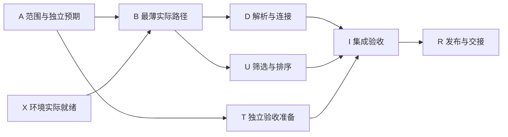

# 成果、依赖、估计与预案方法

## 目录

- [1. 先分清要交付什么和哪些日期](#1-先分清要交付什么和哪些日期)
- [2. 将成果连接成可检查的工作网络](#2-将成果连接成可检查的工作网络)
- [3. 把人员占用和等待计入预测](#3-把人员占用和等待计入预测)
- [4. 根据新证据更新剩余工作](#4-根据新证据更新剩余工作)
- [5. 在相同条件下比较调整方案](#5-在相同条件下比较调整方案)
- [6. 判断增员何时真正有帮助](#6-判断增员何时真正有帮助)
- [7. 在还有时间时准备可用预案](#7-在还有时间时准备可用预案)
- [8. 主方案和预案不能重复使用同一份人力](#8-主方案和预案不能重复使用同一份人力)
- [9. 输出决定、责任和下一项证据](#9-输出决定责任和下一项证据)
- [10. 把依赖组件的长期维护放进工作安排](#10-把依赖组件的长期维护放进工作安排)
- [11. 来源与采用范围](#11-来源与采用范围)

## 1. 先分清要交付什么和哪些日期

计划把待交付成果、完成证据、依赖和可用资源连起来，用于判断当前选择能否支持目标，以及何时需要改变安排。日期只是其中一个结果。先取得以下输入，再选择计算深度。来源 M1–M5；适配 A1、A5。

| 输入 | 必须分开的内容 |
|---|---|
| 要交付的成果 | 必需行为、可选功能、接收方及完成证据 |
| 日期 | 希望达到的目标、已经获授权的承诺、当前预测、实际完成时刻 |
| 工作和资源 | 未完工作量、等待、人员技能及实际可用日历、不能并行的部分 |
| 依据和未知 | 已观察事实、估计依据、假设、未取得的信息及会改变判断的条件 |
| 决定权 | 谁能调整范围、人员、资金、外部承诺和操作权限 |

预测变化不自动修改承诺。已有承诺也不能反过来证明预测必须符合它。缺少日历、输入或可靠估计时，先给条件化判断和下一项证据，不制造精确日期。

简单任务可以只列一个成果、依赖和完成条件；出现多个人员窗口、并行工作或有准备周期的预案时，再展开后文的安排。这里不要求为每个改动制作完整项目计划。

如果成果需要长期运行并依赖持续变化的外部组件，再按第10节补上组件维护、升级或退出工作。先保留本次交付的成果与完成条件，再明确后续谁维护、何时复查和需要哪些资源。

### 1.1 原创题设

以下“活动节目单发布计划”完全虚构，仅作静态推导。没有运行软件、原型、人员试验、Skill 行为或真实工程案例。所有时长、技能和可用窗口都是题设条件，实际应用前须重新取得依据。

基本版应显示正确节目、版本和顺序；完整版本另有按标签筛选和排序。必需的输入验证、内容正确性、实际发布、独立验收和交接不能为赶期取消。产品和接收方批准了十条虚构节目、两种允许的时间写法及独立预期。

目标是不晚于 `t=15` 可用，题设还已有产品负责人对完整版本在该时刻交付的外部承诺。这里把承诺当作需要处理的事实，不认为它已经可行，也不授权代理修改它。基本版或静态预案都改变交付范围，需要明确决定，不能仍报告完整承诺已经兑现。

甲负责实现，乙负责独立验收和交付核对，丙可能提供帮助，丁负责静态预案制作与交接。产品负责人决定范围和对外承诺，团队负责人安排人员。书籍不能替这些角色作实际人员决定。

后文“参考估计”指为比较方案而选定的一组时长，不表示平均值、最可能值或承诺。时间以连续工作日边界计，题设日历一致，没有周末或节假日。每人每天只有六小时可用于这些任务；半天为三小时，四分之一天为一点五小时。其余时间不能借来填补缺口。实际工作须使用真实日历和可用时间，不默认一天八小时都能用于当前任务。

## 2. 将成果连接成可检查的工作网络

工作项应结束于可判断的成果。代码提交、已花费时间或“完成百分之九十九”不足以证明交付完成。具体验收依据可复用[验收依据与变更影响方法](acceptance-evidence-change-impact.md)。来源 M2–M4。

| 工作项 | 依赖 | 所需人员与参考时长 | 完成事件 |
|---|---|---|---|
| A：范围与预期 | 无 | 甲、乙各一天 | 版本化输入、两种写法、行为和独立预期获确认 |
| X：外部环境 | 无 | 外部等待三天，不折成人时 | 实际权限和环境可核实；预计日期不是完成证据 |
| B：最薄实际路径 | A、X | 甲、乙各一天 | 可识别候选在目标环境中构建、部署并读取批准小样 |
| D：解析与数据连接 | B | 甲三天 | 两种写法、错误输入及实际连接满足规定结果 |
| U：标签筛选与排序 | B | 甲两天 | 规定输入、选项和错误路径符合预期 |
| T：独立验收准备 | A | 乙两天 | 数据、独立预期和观察安排就绪；尚未证明实现通过 |
| I：集成验收 | D、U、T | 甲、乙各两天 | 所选范围的必要检查实际通过，绑定候选、数据和环境 |
| R：发布与交接 | I | 甲、乙各一天 | 验收过的候选按权限交付，访问、状态和接收范围确认 |

下图表示成果依赖。D 与 U 在图中可以并行，但原人员安排都需要甲；判断日期时还必须加入资源约束。

“最薄实际路径”只说明一条必要连接已经贯通，不表示全部功能就绪。临时环境或假服务只能支持其覆盖的结论；尚未打通的组织、权限和目标环境仍然未知。早期以最小有意义路径取得反馈，不要求先完成所有结构设计。来源 G1–G3、M7–M8。

本题 I 要求两人对同一候选连续核查，不能随意拆散或中途换版本。D 可以在明确子步骤结束处暂停，以参加复核。实际任务采用不同安排时，需要说明进度如何保留、哪些检查重做，而不是直接沿用本题时长。

## 3. 把人员占用和等待计入预测

### 3.1 基准安排

| 工作项 | 工作日区间 | 人员或等待 |
|---|---|---|
| A | `[0,1]` | 甲、乙 |
| X | `[0,3]` | 外部等待 |
| T | `[1,3]` | 乙 |
| B | `[3,4]` | 甲、乙 |
| D | `[4,7]` | 甲 |
| U | `[7,9]` | 甲 |
| I | `[9,11]` | 甲、乙 |
| R | `[11,12]` | 甲、乙 |

区间表示占用到右端时释放，首尾相接不重叠。甲投入 `1+1+3+2+2+1=10` 人日，即六十小时；乙投入七人日，即四十二小时。总投入一百零二小时，参考完成时刻为 `t=12`，距目标 `t=15` 有三天余量。

直接算 `102÷(2×6)=8.5` 天，隐含了全部工作可连续并行且没有等待，不能作为完成日期。若只看依赖图，把 D 排在 `[4,7]`、U 排在 `[4,6]`，就会得到在 `t=10` 完成的过早结论：甲在 `t=4` 到 `t=6` 之间被重复分配。来源 M1、M4；适配 A1。

B 的开始至少受两条链约束：X 从零到三；A 从零到一，再由乙完成 T 到三。后一条链的最后一段是乙的资源占用，不能只靠 A 到 B 的依赖箭头看出。若 X 提前到二，B 仍要等乙到三；若 X 延到四，或 A 延迟使 T 到四，B 和后续完成都会相应后移。先检查这些实际约束，才能判断给哪项工作增加支持有用。

把顺序改为 U `[4,6]`、D `[6,9]`，仍然在 `t=12` 完成。某项工作更早获得反馈可能有价值，但不能据此宣称总历时已经减少。余量也不是可任意消耗的统一储备；某项延迟是否影响完成日，须看它的后继与资源占用。

### 3.2 区间说明条件，不提供伪造概率

初始估计为 X 两到四天、D 两到四天、U 一到三天、I 两到三天，B、R 各一天。这些是题设允许的情景范围，不是统计置信区间或百分位。

T 固定在 `[1,3]`，B 又需要乙，所以 B 最早开始还受 T 限制。在本题这个特定安排下：

`完成 = max(X,3) + 1 + D + U + I + 1`。

取允许的最短组合，得到 `3+1+2+1+2+1=10`；最长组合得到 `4+1+4+3+3+1=16`。这不是“百分之多少会在十到十六之间完成”，也没有证明未识别返工不会越界。没有联合分布与相关性依据时，不给按时概率。实际端点无法同时出现时，还须调整组合，不能机械相加。

参考预测 `t=12` 早于承诺 `t=15`，范围上端 `t=16` 却超过承诺。这项风险从一开始就应报告，不能只选择参考值让计划显得可行。目标、条件化预测和承诺分别保留。来源 M2–M3；适配 A1、A5。

## 4. 根据新证据更新剩余工作

### 4.1 学习要回答一个能够区分的问题

到 `t=3`，A 和 T 已按证据完成，X 却没有实际到位，B 无法开始。首先更新状态和依赖，不再假装原来在 `t=12` 完成的预测的前提保持不变。

甲获准利用 `[3,4]` 的一天，核对所选解析办法是否支持 A 已经允许的两种时间写法。乙在 T 中给出的标准记录和错误输入预期独立于原型。以下结果都是题设给定事实，本项目没有执行原型。来源 G1–G3；适配 A4。

| 学习安排 | 本题的要求 |
|---|---|
| 要区分的问题 | 两种已批准写法能否正确归一；不是泛泛“研究技术” |
| 输入与预期 | 绑定 A 的输入版本，使用乙提供的独立预期 |
| 时间与费用 | 甲一天、六小时；到点停止，扩大工作需要新的有界决定 |
| 给定结果 | 第二种写法归一错误，输入和输出可以对应，知道哪部分仍未完成 |
| 对后续估计的影响 | D 的未完工作变为归一一到两天、校验一到两天、真实连接及必要局部核查两天，共四到六天 |
| 尚未证明的事情 | 样本不覆盖全部未来输入；X 未到位，B 仍未完成 |

六小时学习投入单独保留，不能再从未来 D 的四到六天中扣除，也不能声称它必然节省了一天。它提供了会改变决定的证据，并消耗真实资源；是否值得继续，取决于剩余未知、影响和成本。

若只有超时、原因不明的崩溃，不能直接降低估计或宣布问题已理解。若假服务连接成功，不能由此把真实权限和部署标为完成。只有能区分所问问题的证据才用于更新相应判断；需要更多学习时，重新选择有限目标与停止条件，而不是让“探索中”无限延长。

### 4.2 依据尚未完成的工作重新预测

在 `t=4`，X 给出 `t=6` 到 `t=8` 的条件化就绪预测；它仍不是已可用的证明。A、T 保留完成状态，B 未开始，D 按新证据改为四到六天，U 一到三、I 两到三保持。

参考比较取 X 在 `t=6` 就绪，D 四天、U 两天、I 两天、B 和 R 各一天，得到：

| 工作项 | 新参考安排 |
|---|---|
| B | `[6,7]` |
| D | `[7,11]` |
| U | `[11,13]` |
| I | `[13,15]` |
| R | `[15,16]` |

当前参考完成时刻为 `t=16`，比目标晚一天。情景范围为 `6+1+4+1+2+1=15` 到 `8+1+6+3+3+1=22`。最低端刚好等于 `t=15`，不足以宣布原承诺可靠。

这里变化的是依赖预测和未完工作依据，不是完成标准。不能用“八项中两项已完成”估算剩余比例，也不能把环境延迟倍数套到所有工作。已经完成的证据是否仍适用，要看输入、范围和版本有没有变化。来源 M3–M5；适配 A1、A5。

## 5. 在相同条件下比较调整方案

下面的参考比较均以 X 在 `t=6` 实际就绪、B 在 `t=7` 通过、D 四天、U 两天、I 两天、R 一天为前提。条件变化后重算；表内日期不是现实承诺。

| 方案 | 参考完成 | 改善来自哪里 | 代价与条件 |
|---|---:|---|---|
| 保持安排 | 16 | 没有新增改善 | 及时报告原承诺风险并请求必要决定 |
| 先 U 后 D | 16 | 提前取得另一类功能证据 | 同一甲仍需六天，不能缩短总占用 |
| 批准基本版，移出 U | 14 | 本次少做两天可选功能 | 接收方须接受范围变化；不能取消必要验证或假称完整交付 |
| 熟悉工作的丙从 `t=7` 就绪 | 14.25 | U 独立展开，甲保留必要复核 | 能力、可用窗口及接口条件确实成立 |
| 新人只能从 `t=7` 就绪 | 16.5 | U 可分担，但培训及复核抵消收益 | 比保持安排晚半天，不能只看人数增加 |
| 新人从 `t=4` 就绪且可提前培训 | 15 | 培训利用已有等待窗口 | 同样增加工作量；窗口和培训输入必须真实可用 |
| 熟悉工作的丙只能从 `t=10` 就绪 | 15.75 | 较晚分担 U | 仍早于 `t=16`，但赶不上 `t=15` |

批准基本版后，I 的依赖改为 D 和 T，A/B/D 的必要条件保持，验收改为批准的基本范围。其情景范围仍为十四到十九；参考预测 `t=14` 不保证一定按时。后续 U、接收支持和原承诺调整都要有责任，不能默默删功能、测试或交接来维持原日期。来源 M2、M6、P3；适配 A2、A5。

## 6. 判断增员何时真正有帮助

### 6.1 熟悉工作的支持仍然有成本

本分支丙熟悉接口和工具，无须甲培训，但先花半天自读与准备，再做两天 U。甲在 U 实现完成后花四分之一天复核。具体安排为：

- 丙准备 `[7,7.5]`，实现 U `[7.5,9.5]`。
- 甲先做 D `[7,9.5]`，复核 U `[9.5,9.75]`，继续 D `[9.75,11.25]`。
- I 为 `[11.25,13.25]`，R 为 `[13.25,14.25]`。

D 的四天工作没有消失，U 的完成还需要甲复核；I、R 也没有因增员缩短。U 从甲转给丙，总体新增准备三小时和复核一点五小时，共四点五小时，却因并行使参考完成比 `t=16` 早一点七五天。成本增加和日期改善可以同时成立。

该方案距目标 `t=15` 只有零点七五天。按原区间、丙从 B 完成即就绪及相同复核条件计算，情景范围为十四点二五到十九点二五，仍无按时保证。小数只为展示题设算术，不表示实际估计可以精确到四分之一天。来源 M1、M6；适配 A2。

### 6.2 新人的到位时间可以反转选择

若丙只能在 `t=7` 到位，需要甲连续指导一点五天，之后 U 要三天、甲复核一天，则：

| 阶段 | 安排 |
|---|---|
| 两人培训 | `[7,8.5]` |
| 丙做 U、甲做 D 前三天 | `[8.5,11.5]` |
| 甲复核 U | `[11.5,12.5]` |
| 甲完成 D 最后一天 | `[12.5,13.5]` |
| I、R | `[13.5,15.5]`、`[15.5,16.5]` |

甲原来未来需 `D4+U2+I2+R1=9` 人日，现在需 `培训1.5+D4+复核1+I2+R1=9.5` 人日，新人另需 `1.5+3=4.5` 人日。合计多五人日，即三十小时，日期反而晚半天。

但不能把这个结果概括成新人必定拖慢项目。另一分支中，丙从 `t=4` 到位，甲在学习任务结束后有 `[4,5.5]` 的可用时间，A 的接口与样本足以支持培训，而且培训不依赖 X。于是培训可以提前；B 仍为 `[6,7]`，丙做 U `[7,10]`，甲先做 D `[7,10]`、复核 `[10,11]`、再做 D `[11,12]`，I `[12,14]`、R `[14,15]`。

新增三十小时完全相同，参考日期却从十六点五变成十五，因为日历条件改变。它仍没有日期余量。如果甲已有其他承诺、X 提前使 B 需要甲，或培训依赖尚未稳定的接口，不能再次借用该窗口。

丙在 `t=1` 就到位也不代表 D/U 能在 B 之前开始。前期能够吸收多少工作，取决于明确输入、可独立完成的准备与反馈，不由总人头决定。可以安排有界熟悉或学习，但不能把空档全算成功能产出，也不能用忙碌程度评价个人。来源 M6、P3–P4；适配 A2。

### 6.3 增员不能消除不受它影响的等待

熟悉工作的丙若只能在 `t=10` 开始，准备到 `t=10.5`、U 到 `t=12.5`，甲复核到 `t=12.75`；I、R 分别到 `t=14.75` 和 `t=15.75`。它仍有有限帮助，却不能沿用早到人员十四点二五的结论。

若 X 直到 `t=12` 才真正可用，B 最早在 `t=13` 结束。即使 U 瞬间完成，D 四天、I 两天、R 一天仍使完整交付不早于 `t=20`。熟悉支持的具体安排到 `t=20.25` 完成，不增员则到 `t=22` 完成。增员可以缩短可并行部分，不能据此证明环境会提前，更不能保持在 `t=15` 交付的承诺。

不同工作之间的频繁切换也可能增加恢复成本。本题仅采用已声明的复核中断；实际还有支持轮值、会议或其他项目时，需要重新核查可用时间和切换影响，不能在原六小时之外重复计入。来源 P4。

## 7. 在还有时间时准备可用预案

### 7.1 将自己的履约风险一起考虑

团队即使拿到了环境，也可能未完成解析、集成或独立验收。预案不能只防外部供应方延期，也不能用“必须成功”取消自身风险。来源 P1–P2。

本题备选为当前批准版本的静态节目单包，不含在线筛选或应用入口。题设另有能够处理这些数据的制作工具及已有发布渠道，独立于 X 和新 D；这是需要证据的能力前提，不代表已在真实环境验证。缺少工具能力、当前输入或权限时，预案不可用，不能假设总有人能临时手工完成。

静态包和基本版应用也不同。接收方要明确接受实际使用方式，原完整承诺须单独处理。输入有较新变更时，应采用新批准版本并重估，不能用旧文件声称已满足新要求。

### 7.2 倒推最迟决定，同时检查日历

| 阶段 | 时长 | 人员及完成条件 |
|---|---:|---|
| C0：批准范围与资源 | 0.5 天 | 产品与接收方明确答复，并确认输入、人员和渠道 |
| C1：制作静态包 | 2 天 | 丁完成对应版本的包 |
| C2：独立核查 | 1 天 | 乙核对内容、版本、错误输入及读取 |
| C3：发布与交接 | 1 天 | 丁按权限发布并取得接收确认 |

总计四点五天。要在 `t=15` 完成，最迟在 `15−4.5=10.5` 提出决定，并在 `t=11` 得到批准，随后 C1 `[11,13]`、C2 `[13,14]`、C3 `[14,15]`。

零点五天批准时间必须包含实际答复和资源确认。审批排队、人员不在或渠道受限时，应加上等待再算；最迟窗口不是推荐拖到最后的日期。在 `t=11` 才提出决定，最早到 `t=15.5` 完成；等到 `t=15` 确认主方案失败才开始，最早到 `t=19.5` 完成。待方案失败才临时“启动预案”，常常已经错过响应时间。适配 A3。

`t=3`、`t=4` 的事实变化即应报告，不等 `t=9` 才首次说明风险。在 `t=9` 再次核查必要成果、当前预测、人员和渠道，提出启动、调整范围或其他选择；如果此前证据已表明需要行动，就更早决定。没有答复时按既有责任升级，沉默不是批准。

### 7.3 自身延期的具体分支

考虑一个独立的 `t=9` 分支：X 已经可用，B 已完成，但 D 的独立核查发现仍至少需要四天。即使 U 瞬间完成，完整方案最早也要 `9+4+2+1=16`，不能再把问题只归给环境。

本分支已确认丁在 `[9.5,11.5]`、`[12.5,13.5]` 可用，乙在 `[11.5,12.5]` 可用，静态工具、当前输入及渠道条件也满足。若在 `t=9` 提出决定、`t=9.5` 取得明确批准，则制作到 `t=11.5`、核查到 `t=12.5`、交付到 `t=13.5`。

这个安排展示提前准备带来的选择，不保证静态包必然通过。任一核查失败、批准未取得或输入版本改变，都须停止相应推进并重估。完整承诺仍需明确调整；不能用静态包已经制作代替实际接收。

## 8. 主方案和预案不能重复使用同一份人力

本节是另一条条件分支，不与前节 `t=9` 的安排拼接成一条轨迹。熟悉支持的主方案在 `t=14.25` 完成，要求乙参与 I `[11.25,13.25]` 和 R `[13.25,14.25]`；预案在 `t=15` 完成，要求乙参与 C2 `[13,14]`。

三项占用存在冲突。同一位乙不能同时支撑这两个按时承诺，预案也不是免费的资源余量。

| 选择 | 乙的实际安排 | 结果 |
|---|---|---|
| 完整主方案优先 | I 到 13.25，R 到 14.25，然后 C2 到 15.25 | 丁再做一天 C3，静态包到 16.25 |
| 预案优先 | C2 在 13–14；本题连续两天 I 只能改到 14–16，R 到 17 | 静态包在 15 完成，完整主方案到 17 |

只把 C2 延后到 `t=13.25`也不够，因为主 R 同样需要乙。必须检查所有后续占用，而不是只解决第一处重叠。

产品和团队负责人需要选择保留哪些承诺及窗口。只有实际释放另一方的预留，或证实另有合格且可用的人，才能计算新的安排；不能一边沿用主方案十四点二五，一边宣称预案必定十五可用。来源 P2–P4；具体安排为适配 A1–A3。

## 9. 输出决定、责任和下一项证据

计划更新应使下一位读者看清当前可以做什么，而不只是看到一张移动后的日期表。一次任务可以按需要交付以下简短记录：

| 内容 | 应给出的依据 |
|---|---|
| 事实和未知 | 已完成的成果及证据、仍缺输入、实际资源与依赖状态 |
| 当前预测 | 未完工作、日历、条件化参考比较及情景范围，不伪造概率 |
| 可选方案 | 相同条件下的范围、顺序、人员或预案选择，代价及反例 |
| 需作的决定 | 哪个负责人、什么权限、最迟响应点以及未获回应的升级 |
| 下一项证据 | 将核查什么、独立预期、允许范围、成本和停止条件 |

状态公开和行动请求要分开。及时报告 X 未到位、D 的未完工作和当前预测，不等于请求上级立即接管全部工作；准备预案、占用乙的窗口、改变范围和对外承诺也不是同一个授权。明确当前责任和需决定事项，避免报告坏消息反而引发无边界的操作。来源 M5；适配 A5。

决定形成后，保留获准成果、输入与候选版本、人员日历、条件、预测和未决责任。旧承诺的变化需要可查确认，不覆盖原记录。完成仍依据成果与观察，不能靠签字、修改计划或宣布“已经恢复正常进度”代替。

外部就绪变化、关键工作完成或失败、学习达到上限、人员或预案预留变化、输入及范围更新，都会触发重新检查。一次日期推导不认证后续性能、真实产出或团队状态；更完整的交付证据可复用[同一制品与晋级证据方法](artifact-promotion-evidence.md)。

## 10. 把依赖组件的长期维护放进工作安排

依赖组件是软件为了完成某项功能而使用的库、服务或工具。维护者依据实际用途、支持约定和变化情况，决定继续使用、升级、替换或停止使用。组件之间的调用和版本要求说明哪些软件会受变化影响；前文的工作网络说明谁在什么输入与资源条件下完成工作。先调查组件，再把查明的维护工作放入工作网络，才能估计日期与成本。组件数量或版本箭头本身不提供人力和工期。来源 H1、H2；具体安排为适配 A6。

### 10.1 采用时同时确认谁能持续维护

当使用期足以遇到提供者变更、平台变化或安全修复时，首次接入只是起点。采用方应把下列事实与尚待取得的证据放在一起；已依赖一个组件但没有这些记录时，先补关键缺口，再作新的长期承诺。来源 H1。

| 要确认的内容 | 形成的工作与完成证据 |
|---|---|
| 用途及预计使用期 | 写清依赖哪些能力、哪些已知消费者会使用；预计寿命只是判断依据，需要随实际使用变化重查 |
| 支持与取得方式 | 核对当前版本、来源、支持的用法和环境、变更说明及已知支持期限；没有公开期限时保留未知 |
| 实际维护者 | 确认能理解组件及本方用法的人、可用时间、接替安排和需要的权限；名单中有名字不代表这些条件满足 |
| 可用检查 | 确认提供者检查能否取得和运行、本方关键使用如何观察、预期由什么约定确定；检查本身也需要维护 |
| 持续投入 | 将跟进变化、熟悉更新、适配、独立检查、交付、支持和必要的分支同步分别估计；保留紧急修复与退出所需资源的缺口 |
| 复查触发 | 支持结束、重要变更、人员离开、知识过期、检查失效，以及直接或间接使用扩大时，重新确认负责人、资源和范围 |

安排定期查看变化和有界的小步升级，有助于保留操作知识，并较早发现适配成本；频率应由支持节奏、风险、资源和任务寿命确定。不能从“应持续维护”推导出每周升级、所有版本都采用或每次升级必然更便宜。维护者需要保存实际用法、容易出错的步骤、检查依据和下一位接手者能使用的说明；说明已经写好，也不证明接替者有时间与能力完成工作。

若组件从一个试用功能扩展到多个系统，原先的维护投入可能已经不足。负责人应检查可见的直接和间接使用，说明哪些使用尚不可见，再决定补资源、限制新增采用或准备替换。声誉和流行度可以帮助调查，不能代替支持事实，也不能证明已有检查覆盖全部用户。采用新组件和自行实现都需要维护；比较时应保留两者的完整责任，不能只拿一次导入与全部自研成本比较。

### 10.2 按实际控制权分配升级工作

采用什么版本安排，应根据本项目能够取得的证据与实际权限判断。以下检查从待交付的结果倒推责任，不要求按某一本书的策略分类选择方案。

1. 写出本次必须保持的结果，以及已经知道的消费者；不知道谁在使用的部分单列，不写成已经覆盖。
2. 对每个受影响对象，确认谁能读取相关事实、运行检查、修改实现与批准交付。这四种能力可以属于不同参与者。
3. 把尚缺的输入、权限、环境或人员窗口放入工作安排。一次版本选择只结束“选哪个”的决定，不替代适配、检查和接收责任。
4. 无法直接检查外部使用方时，由有权限的一方核对具体影响并返回结果；没有回复继续保持未知。维护责任不会自动产生访问、修改或发布对方系统的权限。
5. 比较可行方案的剩余工作、等待、停止条件和恢复成本，再决定继续、暂缓或退出。方案名称和工具运行成功都不能单独证明适合本项目。

这份清单是本方法的原创工程推导。H2、H3仅作为组件维护问题的背景阅读，不把原书的策略分类、组织案例或效果结论作为本节交付内容。后续步骤与虚构时间线分别见第10.3–10.7节。

### 10.3 每次升级都结束于可核查的成果

一次升级应有起点、有限目标和停止条件。先记录当前组件、实际依赖组合、输入、环境及已知消费者，再说明为什么现在需要变化、谁承担实施与检查、哪些证据不足会暂停推进。把工作拆成以下成果，并按第3节加入等待与人员日历。来源 H1、H2；实施步骤为适配 A6。

1. 维护者核对变化与实际使用，确认新版本可取得、需要哪些知识和权限；不能把预计发布日当作上游已经就绪。
2. 有权限的实施者完成有限适配，保存实际输入和生成的候选。若引入新的共享组件或改变部署条件，重新检查影响范围与估计。
3. 检查负责人依据已确定的行为与独立预期核查受影响用法。提供者自己的检查、本方检查及尚未观察的用户分别记录；失败需要定位，不能为了让结果通过而移除必要条件。
4. 交付负责人按授权推进同一候选，保留验证结果与候选的对应关系，并核对启用、接收及恢复条件。换了版本或产物，就重新判断哪些旧结果仍适用；持续升级不会使上一候选的通过自动转移到下一候选。
5. 维护者把本次遇到的实际限制、剩余工作和下一次触发写入交接信息。检查失效、关键知识无人掌握或后续资源未落实时，明确报告维护能力缺口，不能以一次发布成功把长期责任关闭。

候选身份和晋级证据继续按[同一制品与晋级证据方法](artifact-promotion-evidence.md)处理。版本选择、适配成功、检查通过和获准交付是不同事件；日期预测应反映还差哪个事件，而不是统称“升级完成”。

提供组件的一方还应确认问题接收者、变更协调者、内部与外部分支的同步投入，以及支持平台所需的工具和人员。消费者负责自己能够观察和控制的使用、有效检查及采用决定。支持范围、期限或外部承诺的变化，由有相应权限的人确认。接口中应承诺哪些行为、如何判断替换是否破坏调用，使用模块方法的对应判断；这里把这些判断产生的维护与迁移工作计入资源和时间。来源 H3。

### 10.4 知识、上游等待和人员窗口如何改变日期

以下是节目单已经交付之后的一段独立虚构情景，时间改用 `u`，不与前文 `t` 的各个分支拼接。每天仍有六小时可用于所列工作。节目解析使用虚构组件 Q 的 q1；题设提供者对 q1 的支持在 `u=10` 结束，接收方要求此后使用受支持版本。这是本题给定的条件，不是现实组件的期限，也不是对所有软件的统一规定。

甲负责维护，乙负责独立检查及交付核对。甲需要一天核对当前用法和维护知识，再用两天适配 q2；适配必须等待 q2 实际可取得。其后甲乙共同连续检查一天，再共同交付一天。乙在 `[3,5]` 已有别的承诺，其余本题所列窗口可用；这份占用不能借来赶期。题设 q2 在 `u=2` 实际就绪，检查及交付都按预定条件通过，于是：

| 成果 | 参考安排 | 必须满足的条件 |
|---|---|---|
| 当前用法与知识核对 | 甲 `[0,1]` | 已识别本题采用范围、检查依据和未完工作 |
| 新候选适配 | 甲 `[2,4]` | q2 实际可得，知识核对完成；上游是否发布由提供者决定 |
| 独立检查 | 甲乙 `[5,6]` | 同一候选、输入和独立预期就绪，乙的既有占用已经结束 |
| 交付与核对 | 甲乙 `[6,7]` | 检查通过，具备交付权限与接收条件 |

参考完成时刻为 `u=7`。甲投入五人日即三十小时，乙投入两人日即十二小时，合计四十二小时；`[1,2]` 等上游和 `[4,5]` 等乙是等待，不能重复算为人员投入。`u=10` 前的三天只是这些条件下的余量，不能证明下一次升级也只需七天。

若名单中的甲已经很久没有维护 Q，核对和重新熟悉需要四天，其他条件保持，则安排变为甲 `[0,4]` 核对、`[4,6]` 适配，甲乙 `[6,7]` 检查、`[7,8]` 交付。总投入变为六十小时，增加十八小时；完成只晚一天，因为新增工作吸收了原先部分等待。这个分支说明要同时重算投入和日历，不能从“负责人没有变”推导知识仍可用，也不能把额外三天工作机械换成三天延期。

若知识仍保持，但 q2 实际到 `u=8` 才可取得，则适配 `[8,10]`、检查 `[10,11]`、交付 `[11,12]`，完成已经越过 `u=10`。增加本方人员不能证明提供者会提前发布，跳过检查也不满足完成条件。维护者应及时更新预测，并请有决定权的人选择仍可成立的替换、范围调整或停止使用安排。以上时长均为原创题设，没有执行升级、软件检查或人员试验。适配 A7。

### 10.5 暂不升级需要有效期限和失效条件

暂缓决定应写清本次保留哪个版本和哪些用法、理由、到何时复查、谁跟进变化，以及准备下一步所需的资源。可以因为使用期短、尚无相应价值、检查条件未就绪或升级风险较高而暂缓；这些理由必须对应事实。暂缓期间仍需关注支持结束、安全信息、平台与间接依赖变化，不能把“版本已固定”当作风险已消失。来源 H1、H2；具体复查安排为适配 A6。

在上述独立情景中，若 `u=1` 暂不实施升级，决定可保留 q1 的已知受支持用法，同时由甲跟进 q2 就绪情况，在 `u=4` 复查。负责人还需保留检查与交付窗口，并确认第10.6节的替换方案是否真能准备好。出现紧急安全或平台变化时，应立即重查这项暂缓决定；不能等到原复查点再响应。没有可接受的继续使用条件时，提出停用或调整业务安排，不能默认旧版本始终可回退。

复查日期和最迟启动时间是不同信息。到了复查点仍无新证据，就保留未知并按既定责任升级处理；不能不断把日期向后移而继续声称原决定有效。预留资源有成本，若已被别的工作占用，暂缓方案也必须重新计算。

### 10.6 退出也要准备、验证和交接

退出一个组件，是让约定范围内的使用方不再依赖它，并完成替代或停止使用所需的交付与责任移交。维护者应先调查已知直接和间接使用、支持承诺、跨平台和分支情况，区分已确认退出的消费者与仍不可见或未答复的对象。删除包名或停止上游同步，只能证明做过相应操作，不能证明依赖已消除。退出步骤为工程适配；来源 H1、H3提供长期成本与责任依据。

准备退出时，明确替代能力或获准停止的功能、输入处理与历史结果保留要求、消费者迁移、必要检查、切换及接收确认。支持承诺限制了能在什么时间结束服务；未承诺的实际用法仍可能产生迁移成本，但不因此自动产生永久支持所有用法的义务。无法取得决定性证据时，保留未完责任并请求相应决定，不擅自公布终止支持或操作外部消费者。

继续用第10.4节的独立情景比较：题设已有另一条可行的解析办法 W，支持本题两种时间写法，且不依赖 Q 的修复；这一可行性必须有对应证据。采用 W 仍需明确批准半天、甲实现两天、甲乙独立检查一天、甲乙交付一天，合计四点五天。若要在 `u=10` 完成，最迟在 `u=5.5` 提出决定，并在 `u=6` 获得批准，随后实现 `[6,8]`、检查 `[8,9]`、交付 `[9,10]`。到 `u=6` 才提出，在相同条件下最早 `u=10.5` 完成，已经错过要求。

倒算成立还需要批准者实际答复、甲乙的这些窗口已确认、W 的支持与权限可用，以及每一步检查通过。若沿用 q2 按时分支，甲乙原有 `[6,7]` 的交付安排会与 W 的实现冲突；负责人必须选择方案并实际释放相应预留，不能同时承诺两个日期。若 W 的关键能力尚未证实，应先增加有界调查，重新倒算；若核查失败、出现未迁移消费者或输入范围改变，应停止相应交付并重估。这个备选方案不能因为被称为“退出”就免除正常的成果与证据责任。适配 A7。

### 10.7 留下能够继续维护的决定

在第9节的输出中，补上当前依赖组件与使用范围、支持事实、具备知识和时间的负责人、下一次检查及其触发、升级或退出所需窗口和未完成的消费者责任。简单且短命的任务只保留影响决定的内容；长期运行、跨组织或广泛复用的组件需要更完整的支持安排。

交付某个候选结束了本次有限任务，后续维护仍由确认的角色和触发条件承接。人员更换、使用扩大或上游支持变化，都可能使旧安排失效。及时报告变化与申请操作权限仍然分开；计划和来源不替任何人作新的外部承诺。

## 11. 来源与采用范围

| 标识 | 来源与定位 | 本方法采用 |
|---|---|---|
| M1–M2 | 《人月神话》，`OPS/chapter7.html`：人月、乐观主义、系统测试及估算正文 | 工作量与历时、拆分及沟通成本、必要工作与估计依据；固定阶段比例不采用 |
| M3–M5 | 同书，`OPS/chapter26.html`：里程碑、依赖与状态报告正文 | 客观完成事件、计划和估计、依赖及状态/行动信息 |
| M6 | 同书，`OPS/chapter31.html`，body/div 子节点 128–140（从 0 计数，含两端） | 后记对增员结论的限定，学习、指导及重新分工成本；模型系数与历史数字不采用 |
| M7–M8 | 同章，body/div 子节点 62–92（从 0 计数，含两端） | 对一次顺序通过和晚集成的修正，渐进增加可运行功能与反馈；绝对不超支保证不采用 |
| P1–P2 | Peopleware 第 30 章，PDF 文件页 202–205，印刷页 183–186 | 自身履约风险、提前备妥响应及其责任 |
| P3–P4 | 同书第 32 章，文件页 213–216，印刷页 194–197 | 任务吸收能力、早期人数和切换成本，排除固定比例与个人评价 |
| G1–G3 | GOOS 第 4 章，文件页 56–62，印刷页 31–37 | 最薄端到端路径、早期学习、临时环境和既有系统的限制 |

A1 为资源受限的工作网络与情景范围；A2 为到位、培训、复核和净帮助的具体比较；A3 为预案准备、批准、验证及时间窗口倒算；A4 为有明确问题和证据的有限学习及估计更新；A5 为目标、承诺、预测和决定责任的分别处理。这五项是工程适配，不声称原书提供了本题完整算法。

《人月神话》二十周年纪念版与 Peopleware 第三版已有身份依据，GOOS 版次编号仍待核实。本次采用保存的连续正文；图示、公式、历史生产率、原书项目和人物故事没有作为原创推演或当前平台事实。完整原书不是运行依赖。

本方法支持计划、估计、增员和预案的限定判断。设计决定权、团队信任受损及协作改善还需对应方法；本篇不能据此评价个人，也不能将静态推导宣布为整体工程能力已经验证。

H1–H3采用 Software Engineering at Google 的2020官方HTML第21章 `resources/swe-book/html/ch21.html`。H1对应 G21-C01，定位为 Compatibility Promises、Considerations When Importing 及 How Google Handles Importing Dependencies 的相关正文；采用持续维护、知识与实际承担者。H2对应 G21-C03，第21章有关依赖安排及资源限制的讨论仅供背景阅读；本篇不复述其策略分类或组织案例。H3对应 G21-C04，定位为 Exporting Dependencies 及其相邻历史例证；采用提供者长期维护、同步和退出成本。历史组织做法与产品案例只解释条件，不作为当前服务承诺或本题事实。

A6是把已查明的组件维护责任转成有输入、资源、成果、停止条件的工作安排；A7是交付后维护的原创时间线与暂缓、升级、退出比较。两项均为工程适配，书中没有给出本题的时长、角色安排或完整退出程序。G21-C02的版本求解和具体接口兼容判断由相应模块方法处理；H3在本篇只采用长期投入与维护安排，不扩写接口支持细节。持续升级与每次候选证据的衔接沿用现有交付方法，不据此增加其他章节的来源采用。
